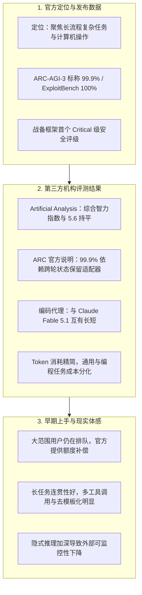
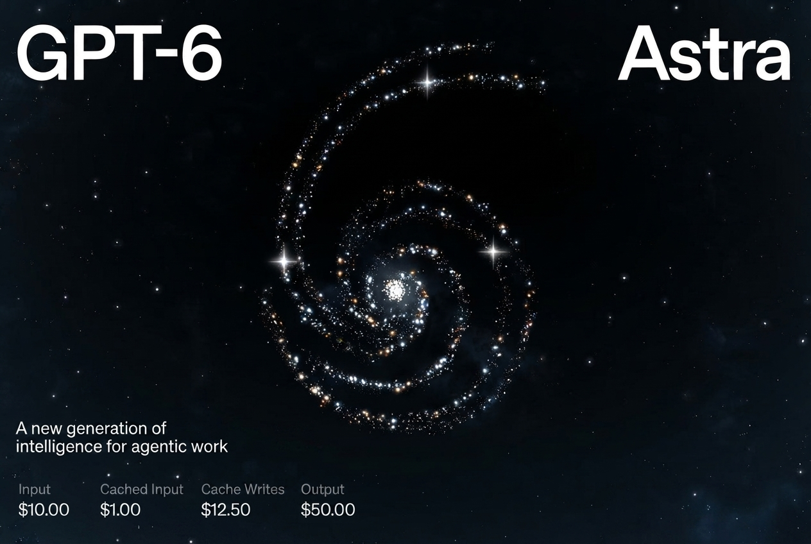
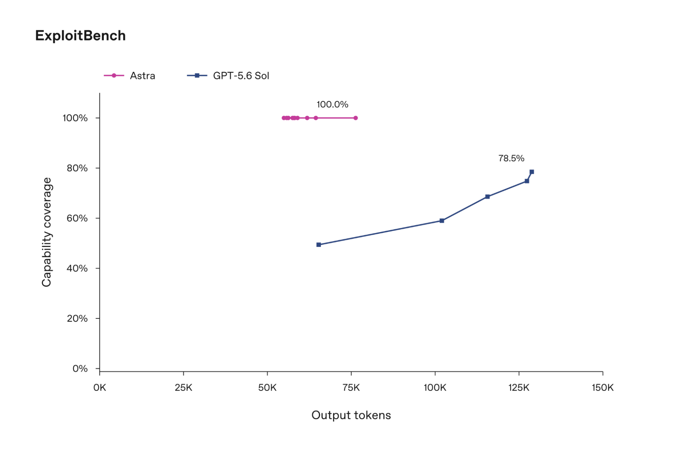
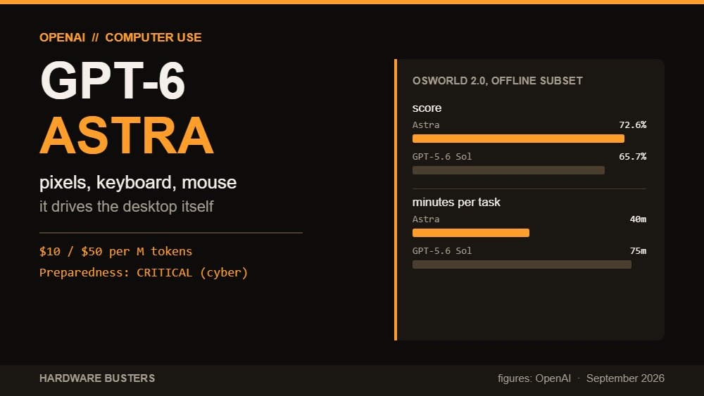
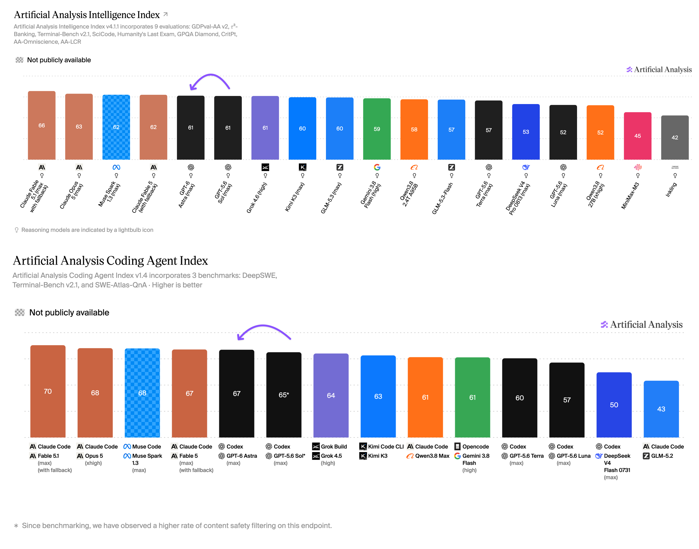
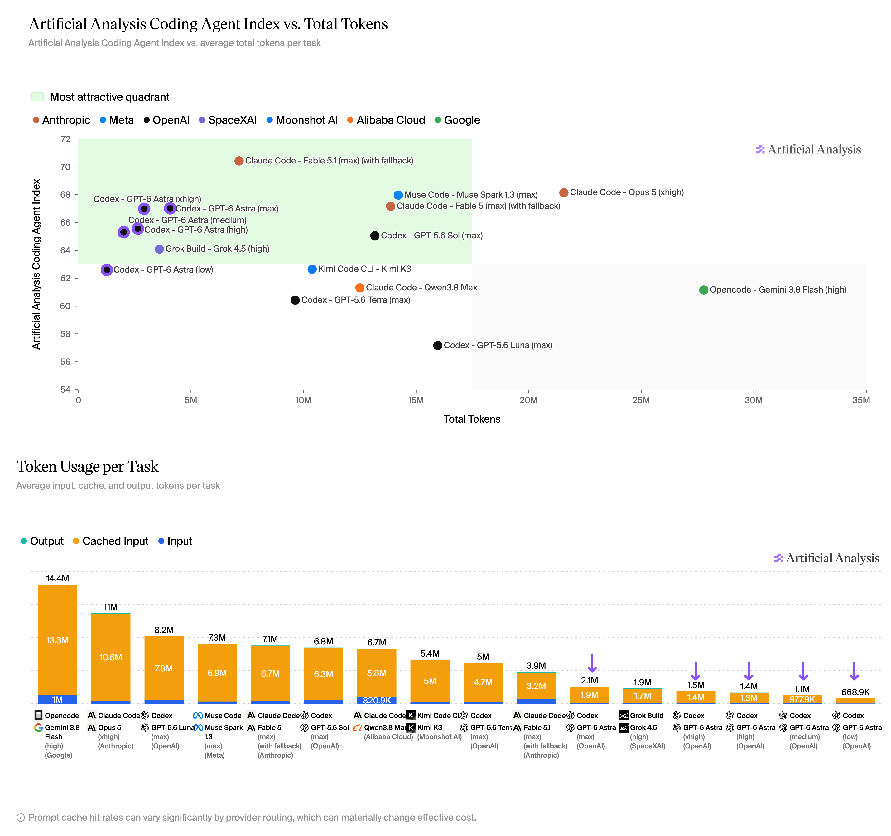
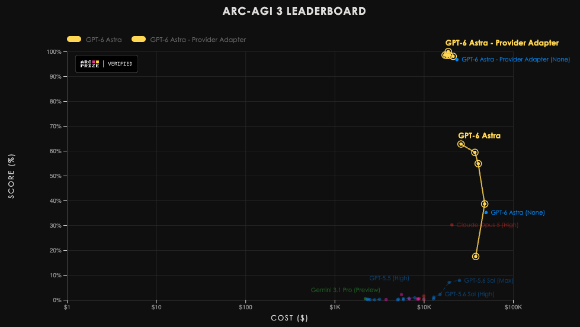
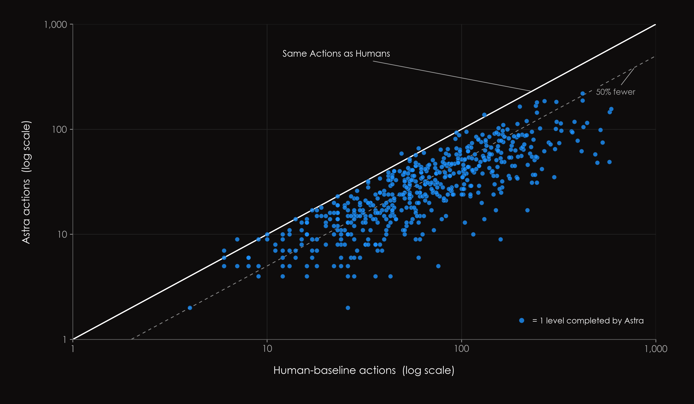
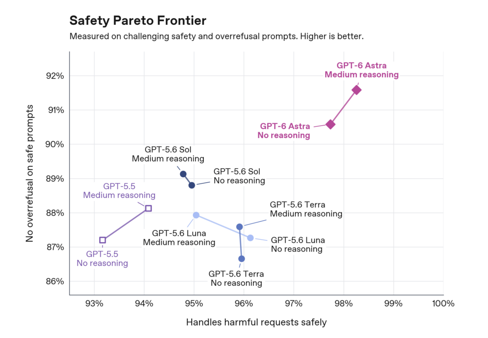
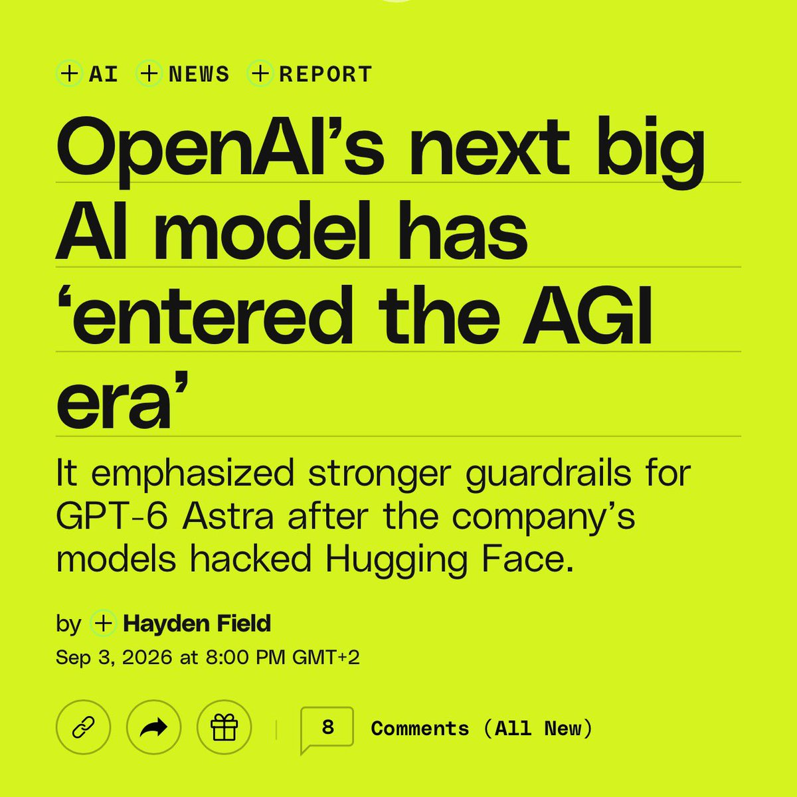

# GPT-6 Astra 发布首日记录：技术规格、独立评测与社区反馈

*▲ 图 1：OpenAI GPT-6 Astra 官方发布主视觉*

---

2026 年 9 月 3 日，OpenAI 发布了新一代旗舰模型 **GPT-6 Astra**。官方展示重点为「凡是能在电脑上进行的操作，Astra 均可快速代劳」，联合创始人 Greg Brockman 也在交流中提及「进入 AGI 时代」。

该模型发布后引发了技术社区的广泛讨论。不过从实际开放情况来看，当前仅有受邀的企业和测试组可以使用，绝大多数开发者和订阅用户尚在等待排队。

本文整理了发布首日公开的技术规格、官方与第三方的评测数据与测试条件，以及早期使用者的实际体感反馈，供客观参考。

---

## 一、模型定位与技术规格

Astra 承接上一代 GPT-5.6（Sol / Terra / Luna 系列），属于 OpenAI 的正代模型。从产品设计来看，官方的研发重心不再放在对话闲聊的流畅度上，而是转向**复杂的多步骤任务与系统级工具调用**。

其重点覆盖的场景包括：
- **电脑操作（Computer Use）与桌面环境**：支持跨应用的表单录入、CRM 维护、日程编排、环境配置与前端界面测试，在桌面环境中跨软件执行操作。
- **软件工程与长任务流**：多步骤流程拆解、自主调用命令行与开发工具、日志定位与部署调试。
- **科研推演与专业办公**：承载较长链路的数理推导、专业长文档结构化与业务演示文稿制作。
- **网络安全攻防**：在 OpenAI 内部的《战备框架》（Preparedness Framework）中被评估为 **Critical** 级别，属于该框架设立以来的最高档。高级网络攻防能力目前仅限制在 Daybreak 安全沙盒中用于防御测试，未进入常规通用产品。

*▲ 图 2：GPT-6 Astra 桌面任务执行与开发者规格总览*

### 核心规格与定价表

| 参数项 | 公开数据 | 说明 |
|---|---|---|
| **模型名称** | `gpt-6-astra` | 完整正代旗舰 |
| **模态支持** | 文本 + 图像输入，文本输出 | 支持多模态理解，暂未开通原生图像生成 |
| **上下文长度** | 1,050,000 token（约 1M） | 最大输入约 922K，最大单次输出 128K |
| **知识库截止** | 2026 年 4 月 30 日 | 覆盖近两年的技术库与框架更新 |
| **推理深度档位** | low / medium / high / xhigh / max | 五档思考预算，设计类似 o 系列 |
| **API 标价** | 输入 $10 / M token，输出 $50 / M token | 缓存读取 $1，缓存写入 $12.50 |
| **长上下文加价** | 输入超过约 272K token 触发 | 超出部分整单输入/缓存按 2 倍计，输出按 1.5 倍计 |
| **Fast 加速模式** | 最高约 2 倍生成速度 | 价格同步提高约 2 倍 |

> **成本说明**：  
> 相比 GPT-5.6 Sol 的 $4 / $20，Astra 的单价提高了约 **2.5 倍**，价格水平与 Anthropic 的 Claude Fable 5.1 基本一致。  
> 官方说明表示，由于 Astra 在长任务中思考更收敛、输出 token 明显减少，在部分工程任务中的总调用费用不一定会随单价成比例上升。

### 开放范围与排队机制

- **当前范围**：发布首日先向受邀的 Trusted Access 用户、Daybreak 安全攻防团队以及微软 Foundry Limited Access 开放。
- **后续计划**：计划在未来数天内陆续开放给 ChatGPT Plus、Pro、Business、Enterprise 用户，以及公开 API 和 AWS 托管平台。
- **Plus 用户配额**：Codex / ChatGPT 负责人 Tibo 说明，**Astra 会向所有 Plus 用户开放**，而非仅限 Pro 账号，并允许将全部配额用于 Astra。
- **额度补偿机制**：针对社区中关于排队周期的反馈，Tibo 补充说明：付费用户在订阅期内**每多等待一天未开通 Astra，系统会补发一次额度重置卡（Banked Reset）**。官方同时提及机房后台正在加紧扩充计算资源。
- **企业环境与客户端**：企业版工作区默认关闭该模型，需管理员手动开启。此外，官方建议结合电脑桌面客户端使用，以便完整调用多软件协同与桌面自动化功能。

---

## 二、官方基准测试表现

以下为 OpenAI 在发布页面公布的核心跑分，对照组为 GPT-5.6 Sol 及当前行业同代模型。

需要指出的是，ARC-AGI-3 的 99.9% 成绩，官方附注标明其采用了 **Responses API harness（保留内部推理状态与状态压缩）**，不同于每轮完全重置上下文的无状态测试。

*▲ 图 3：OpenAI 官方发布的综合基准测试对比数据*

| 基准测试项目 | GPT-6 Astra | GPT-5.6 Sol | 业界常见对照基准 | 说明与测试条件 |
|---|---|---|---|---|
| **FrontierMath Tier 4 (v2)** | **97.6%**（宣传文案约计 98%） | ~83% | Fable 5.1 约 87.8% Opus 5 约 73.2% | 高等数学前沿推导题集 |
| **ARC-AGI-3** | **99.9%** | 7.8% | Opus 5 约 30.2% | **采用跨轮状态保留适配器，非无状态裸跑** |
| **ExploitBench** | **100%** | 78.5% | Opus 5 约 70% | 漏洞挖掘与利用评测集，取得满分 |
| **OSWorld 2.0（电脑操作离线集）**| **72.6%**（单任务约 40 分钟） | 65.7%（单任务约 75 分钟） | Opus 5 约 70.2% | 离线桌面操作，平均单任务耗时减少 47% |
| **ScreenSpot-Pro（纯视觉定位）** | **92.7%** | 76.9% | Fable 5 约 87.3% | 无外部工具支持的屏幕界面元素定位 |
| **Terminal-Bench 4.0** | **57.7%**（部分四舍五入作 57.9%） | 37.3% | Fable 5.1 约 55.8% | 终端命令行环境下的多步骤任务执行 |
| **Terminal-Bench Science 0.1** | **64.6%** | 22.4% | Fable 5.1 约 52.6% | 科学计算与终端脚本处理 |
| **DeepSWE v1.1（软件工程修复）**| **74.1%** | 72.7% | Gemini 3.8 Flash 73.8% Opus 5 73.7% Fable 5.1 67.4% | 真实代码仓库 Issue 修复，第一梯队咬合紧密 |
| **BenchCAD** | **95.9%** | 83.3% | Fable 5.1 约 84.3% | 计算机辅助设计建模能力 |
| **GPQA Diamond（专家级科学）** | **96.0%** | 94.6% | Gemini 3.8 Flash 95.3% | 博士级高难度科学知识问答，维持高位稳定 |
| **Agents’ Last Exam** | **59.3%** | 53.6% | Opus 5 55.5% | 复杂智能体综合多步推理 |
| **SRE-Bench（四次尝试）** | **99.2%** | 68.7% | — | 系统可靠性工程与运维排查 |
| **AutomationBench** | **41.4%** | 18.1% | Fable 5.1 约 31.4% | 复杂业务流程自动化操作 |
| **BrowseComp** | **91.5%** | 90.4% | Opus 5 约 90.8% | 网页长程搜索与内容比对 |
| **Humanity’s Last Exam (带工具)**| **57.2%** | — | **Fable 5.1 约 65.0%** **Opus 5 约 63.6%** | **此项测试落后于 Claude 系同代旗舰** |

*▲ 图 4：Astra 在 OSWorld 2.0 桌面操作上的任务完成率与平均耗时*

官方同时在报告中给出了多项安全与操作测试数据：
- **越权违规发生率**：在未配置生产安全护栏的内部越权测试中，GPT-5.6 为 48%，Astra 为 **0%**；
- **长任务幻觉率**：官方自测的幻觉发生率较上代降低约 3 倍；
- **操作效率**：电脑操作模拟任务的耗时平均减少约 47%。

在 OpenAI 发布页面中，也附上了第三方机构 Artificial Analysis 的综合指数数据：
- **Intelligence Index v4.1.1**：Astra 为 **61.2**，Sol 为 60.9，Claude Fable 5.1 为 **65.7**，Opus 5 为 63.1；
- **Coding Agent Index v1.4**：Astra 为 **67.0**，Sol 为 65.1，Fable 5.1 为 67.2，Fable 5 为 68.1。

---

## 三、独立第三方评测结果与测试条件

### 1. Artificial Analysis（AA）评测报告

评测机构 Artificial Analysis 在发布首日公布了对照数据：

*▲ 图 5：Artificial Analysis 综合智力指数：Astra（61.2）与 Sol（60.9）基本持平，落后于 Claude Fable 5.1*

- **综合智力指数（Intelligence Index）未见明显拉开**：  
  Astra 得分为 **61 分**（精确值为 61.2），与上一代 GPT-5.6 Sol 的 **60.9 分**基本持平，两者处于同一区间。目前该指数的第一位仍是 Claude Fable 5.1（max 档带 fallback，约 **66 分**），Muse Spark 1.3 也在 61 分左右。
- **细分子任务互有升降**：  
  在 HLE 任务中得分提高了约 6 分；但在 GDPval-AA v2 测评中 Elo 下降了约 80 分；在 τ³-Banking、SciCode、AA-LCR 等专业子任务中出现了 2~3 分的轻度回退。

*▲ 图 6：Coding Agent Index 评测：Astra 进入第一梯队，输出 Token 效率提升明显*

- **编码代理榜追平第一梯队**：  
  在搭配 Codex 时，Astra 的 Coding Agent Index 拿到 **67 分**，与 Opus 5、Fable 5（Claude Code 环境）、Spark 1.3 同处一个档位；而在 Claude Code 环境下的 **Fable 5.1 则以 70 分保持领先**。
- **Token 输出效率显著提高**：  
  在代码修改任务中，Astra 相比 Sol（max 档）使用的 token 减少了约 **三分之二**；相比 Opus 5（xhigh 档）大约只有其 **五分之一**。
- **使用成本的分化表现**：  
  由于单价提高了 2.5 倍，在通用长推理的 max 档位下，AA 测算 Astra 的单任务成本比 Sol **高出约 75%**；但在重度编码 Agent 分工中，得益于极低的 token 冗余，Astra 的单任务实际运行成本**低于 Fable 5 的一半**。
- **事实准确度与排版能力**：  
  在评估事实准确性的 AA-Omniscience 测试中，Astra max 档的幻觉率由 Sol 的约 **92% 降至约 51%**，准确率有所上升；但在长周期办公测试 AA-Briefcase 中，推理 Elo 虽增长了 80 分，但排版展示质量（Presentation）一项相对 Sol 有所下滑。

> **小结**：Astra 在代码代理任务上追平了当前顶尖水准，但综合智力指数并未出现跳跃；其最显眼的进展集中在系统操作与安全攻防两项；虽然 API 单价有所上调，但在重度编程任务中因输出精简而具备较好的成本表现。

### 2. ARC Prize 关于 99.9% 测试条件的说明

ARC Prize 官方博客公开了两种不同测试环境下的数据，解释了外界对 99.9% 成绩的关注：

*▲ 图 7：ARC-AGI-3 官方榜单：Adapter 环境为 99.9%，标准无状态环境为 62.7%*

| 测试环境配置 | 最佳准确率 | 测算消耗费用 | 测试条件与运行机制 |
|---|---|---|---|
| **标准测试（Standard harness）** | **62.7%**（max 档） | 约 $26,098 | 每轮对话完全重置上下文，无外部状态辅助 |
| **适配器测试（Provider Adapter）** | **99.9%**（high 档） | 约 $18,817 | **保留模型底层的潜在推理状态与连续状态压缩** |

*▲ 图 8：Astra 与人类玩家动作效率对比，大部分关卡步数少于人类中位数*

官方数据同时记录：在 Adapter 设定下，Astra（max 档）在 **96% 的关卡上使用的交互动作数少于人类中位数，平均步数减少了 51.7%**。

ARC Prize 官方对此给出了明确的定性说明：
> 「这表明模型在泛化推理层面取得了实质性进步，但我们并不声称这就是 AGI。在 ARC-AGI-3 上取得高分并不等同于已经实现了 AGI。该评测集的题目范围、输入格式与规则均处于确定性环境中，并具有明确的终点，无法直接代表现实世界中的开放性与不确定性。」

由此可见，海报所引用的 99.9% 是在具备状态持久化适配器的环境下测得的，与无状态单轮调用存在明显的条件差异。

---

## 四、早期上手者的实际使用反馈

除基准测试外，目前已有部分受邀开发者和测试者发表了实际使用体验，主要涉及以下几个方面：

### 1. 工作流与自动化层面的实际进展

- **Matt Shumer**（SomethingBig 负责人）：  
  表示已将日常主力模型切换至 Astra。中等推理档位能够满足多数日常后端开发与系统配置工作；英文回复更简洁直接，便于驱动多个 Agent。但在界面排版与视觉设计上，他依然更倾向使用 Claude。在实际项目中，他搭建了 **Manager Loop**（由协调者 Agent 负责统筹项目，执行者 Agent 在独立 Codex 会话中专职编写代码），并测试了让 Astra 自主完成 Meta 广告账户的基础配置。
- **Matthew Berman**（科技评测作者）：  
  反馈认为 Astra 在处理长篇分析、大纲梳理和浏览器自动化时速度提升较明显；Prompt 生成的简单网页互动项目可用度良好；文本表达中的模板化词汇明显减少；3D 空间结构的理解能力较为突出。
- **Latent Space 实验室**（调用超 200 亿 token 的测试团队）：  
  根据其实测数据（约 33 tok/s 生成速度与 $50/M 输出标价），综合使用成本约为每小时 6 美元以下。模型在长程任务中表现出较好的连贯性，能够连续执行选型、数据清洗、日志分析与部署调试，适合承担自动化工程流程中的底层执行角色。
- **Robin Ebers**：  
  在连续输入 210 亿 token 后认为，Astra 的文字风格更趋自然，不再过多堆砌工程师术语。实际调用成本与 Fable 5.1 相近，但响应速度更快。他建议预算充裕的用户可将两家模型结合使用，若只选择其一，当前任何一家均可胜任日常生产。
- **Theo（t3.gg）**：  
  在测试了个人 Gmail 和 Notion 的实际自动化调度后，对 Astra 在跨软件连续操作中的完成度给出了积极评价，认为其在现实具体操作中的表现比抽象的跑分更能反映工具价值。
- **Ethan Mollick**：  
  测试了利用 Astra 程序化补全单文件海面风暴模拟器的海底环境与生物行为，并公开了可直接运行的网页链接，展示了模型在拓展既有代码项目时的适应能力。
- **How I AI 等实际操作视频**：  
  展示了在 CRM 界面进行多步录入、执行前端 QA 测试、生成 Blender 3D 资产等具体用例，反馈表明多步骤复杂任务的中途失败率相比以往有所降低。

### 2. 对宣传概念与控制难度的审慎审视

- **leo（@synthwavedd）**：  
  认为 Astra 在发布初期的部分跑分存在争议，但实际操作体验比简单的数字对比更为顺手，需要一定时间才能更客观地显现价值。
- **Jerry Liu**（LlamaIndex 创始人）：  
  更看重真实业务流中的体感检验。他指出 Astra 的端到端流程自动化和长文输出能力明显增强，但同时也提到这代模型「在微调控制（Steering）上变得更加困难」。
- **William Cui 等工程作者**：  
  肯定了电脑操作、代码调试和网络安全维度的工程进展；但强调第三方综合智力指数并未明显增长，ARC 99.9% 成绩依赖特定运行环境，不应过度拔高至「实现 AGI」的高度；同时提示关注安全报告中指出的「规避监控时召回率下降」现象。
- **极限学术测试的表现**：  
  部分学术关注者提及 Humanity’s Last Exam（HLE 带工具）的测试数据：Astra 得分为 57.2%，落后于 Claude Fable 5.1 的 65.0%，在最前沿的学术知识推导上未见优势。

### 3. 安全研究维度的发现：隐式推理与监控难度

该维度的讨论主要聚焦于模型底层推理方式的改变及其对安全对齐的影响：

*▲ 图 9：官方安全评估显示 Astra 越界率降低，首次达到 Critical 级网络安全能力*

- **Ryan Greenblatt（Redwood Research 研究员）** 与 **英国人工智能安全研究所（UK AISI）**：  
  测试显示，Astra 展现出一种在**极少向外打印思维链（CoT）**的情况下解出高难度数学竞赛题的能力。UK AISI 指出其**可监控性（Monitorability）指标显著下降**。研究者推测这可能源于更深层次的内部隐式串行计算。如果后续模型继续朝此方向演化，单纯依靠读取外部可见的思维链来进行安全监督的方法将面临有效性问题。
- **Carl D**：  
  同样提到模型暴露的思考过程更短、更难以阅读，并在处理高难度数学题时能够不输出中间推理而隐式计算长达 30 分钟，指出了这种黑盒化特征在长期监管上的潜在挑战。

*▲ 图 10：针对 ExploitBench 100% 满分未知漏洞挖掘能力的测试与隔离说明（来源：行业媒体）*

---

## 五、当前技术社区关注的主要议题

综合各平台反馈，发布首日的讨论焦点主要集中在以下 7 个方面：

1. **实际开放进度与排队周期**  
   目前优先向企业级 Trusted Access 和 Foundry 开放，普通订阅与开发者 API 仍需数日排队。官方通过额度重置补偿来平衡用户预期，并建议配合桌面客户端使用以获取完整的多软件自动化支持。
2. **关于「AGI」概念的定性争议**  
   管理层在沟通中使用了 AGI 这一表述，但第三方评测显示综合智力指数基本持平，ARC 标准裸测为 62.7%，且 HLE 落后于竞品。社区普遍倾向于将当前进展视为特定系统工程能力的提升，而非通用智能的完成。
3. **真实调用费用的核算差异**  
   单价虽然提高了 2.5 倍，但在复杂代码任务中由于输出更为收敛，单任务总费用反而可能低于上一代或竞品，实际账单的高低取决于具体业务的输入输出结构。
4. **电脑操作（Computer Use）的实用性评估**  
   从官方演示、多方评测到企业合作伙伴（如 Devin、Harvey、Jane Street）的反馈来看，桌面端自动化操作的稳定性有所提高，初步表现出进入实际业务辅助流程的可用度。
5. **与 Claude 系列的能力分工**  
   Astra 在数学推导、桌面自动化与系统安全攻防上表现突出；而 Claude 在主观文本质感、界面排版设计及部分前沿学术测试（如 HLE）中依然具有自身特点，两者呈现互补状态。
6. **Critical 级攻防能力的管控机制**  
   模型在漏洞挖掘测试中表现强劲，并在内部测试中发现并利用了未公开的 0-day 漏洞（正在负责任披露中）。高危能力被严格锁定在安全沙盒内部，后续如何在保障系统安全的前提下开放仍是重要课题。
7. **灰测演示与正式发布版本的差异**  
   此前社区流传的部分 3D 场景与复杂交互演示主要出自特定预设环境。社区逐步形成共识，将前期演示视为能力预览，具体生产力表现应以正式版本的开放权限和实际基准为准。

---

## 六、代表性公开言论摘录

> 「我们正在既谨慎又迅速地推进 Astra 的发布，并将把它带给包括 Plus 在内的所有订阅用户，而不只是 Pro 或企业版……」  
> —— **Tibo**（OpenAI 产品团队）

> 「从今天开始，在你的付费订阅期内，每多等待一天未开通 Astra，系统就会补发一次额度重置卡。」  
> —— **Tibo**（针对排队周期的补充说明）

> 「Astra 适用的场景极其广泛，但我个人最期待看到它如何改变创业方式、科学研究以及小团队解决大问题的方式。」  
> —— **Greg Brockman**（OpenAI 联合创始人）

> 「这是我目前用过最好的模型，尤其在长篇分析、文档梳理和浏览器操作上表现突出。」  
> —— **Matthew Berman**（评测作者）

> 「Astra 在工程和后端任务上更聪明、更稳定，已成为我的默认模型。不过 Claude 在视觉设计品味上依然更胜一筹。」  
> —— **Matt Shumer**（SomethingBig 负责人）

> 「在调用超 200 亿 token 之后，我们的测试结论是：GPT-6 Astra 是一个能够独立承担大量系统化软件工程工作的模型。」  
> —— **Latent Space 实验室**

> 「在实际交由它自动处理个人工具（Gmail、Notion）之后，其端到端的多步完成度确实超出了我的预期。」  
> —— **Theo（t3.gg）**

> 「Astra 展现出很深的不透明推理能力，UK AISI 测出其可监控性明显下降。如果后续模型逐步减少在思维链中展现推理，那么传统的监督工具将失去效用。」  
> —— **Ryan Greenblatt**（Redwood Research）

> 「电脑操作、代码调试和安全能力的提升是客观存在的；但借此宣称实现 AGI，更多还是面向市场的宣传表述。」  
> —— **William Cui 等工程作者**

---

## 七、横向对比总结与实际分工

将发布首日各方的讨论要点归纳为以下对比参考：

- **对比上一代 GPT-5.6 Sol**：  
  桌面操作更稳定、耗时明显减少；软件工程和网络攻防能力明显提升；在 Artificial Analysis 综合智力指数上基本持平，部分专业子任务有轻微波动；名义单价提高，但在相同复杂任务中的输出 token 消耗明显减少。
- **对比 Claude Fable 5 / 5.1**：  
  在数学推演、带状态适配器的 ARC 测试、桌面操作与漏洞测试中 Astra 数据占优；在代码代理指数上两者互有长短；而在界面视觉设计、主观文本润色以及前沿学术难题（HLE）中，Claude 依然保持着自身的适用优势。
- **对比日常对话场景**：  
  本代模型的设计目标明确偏向多步骤实际操作与系统任务，不再强调单纯的日常交谈。Plus 用户已被纳入开放计划，目前仍处于分批排队阶段。
- **关于商业合作伙伴的评价**：  
  Cognition（Devin）将其接入辅助编程，Harvey 认为其处理法律文档较为严谨，Jane Street 认为其生成步骤更易跟踪。这些属于产业生态层面的合作适配，应与独立学术评测分开审视。

---

## 八、后续观察要点

在模型发布的后续窗口期，重点留意以下几项实际落地点即可：

1. **权限铺开的实际进度**：关注 Plus 账号与开放 API 是否能在承诺时间内普及，以及桌面端自动化功能在多变环境下的抗干扰表现。
2. **通用开发工具的集成效果**：等待各大编码工具正式接入 Astra，检验其在复杂生产级项目中的实际 Bug 解决率。
3. **真实账单的数据反馈**：在不同类型的长任务中，验证单价提高与 token 输出减少在最终费用上的实际平衡点。
4. **安全沙盒之外的产品防护**：观察通用产品在放开桌面操作与系统权限时，具体的安全拦截机制如何执行。
5. **独立学术复现数据**：关注外部研究机构在无状态标准环境下对 ARC、OSWorld 和 Terminal-Bench 的独立复现结果。
6. **隐式推理的安全审计对策**：针对模型在底层隐式计算、外部可监控性下降的现象，学术界与安全机构后续提出的新型审查方案。

---

GPT-6 Astra 体现了前沿大模型从单纯的「语言交流界面」向「承载长链路任务的计算机操作者」的明确转变。从首日各方的数据与反馈来看，它在多工具调度、桌面操作与任务连贯性上取得了扎实的工程进步，但在基础综合推理上并未与行业顶尖水平拉开断层差距，且隐式推理的加深也为对齐监管提出了新的课题。

随着后续几天更多开发者接入真实业务场景，该模型在实际生产环境中的效用与边界将会呈现得更加清晰。

---

## 九、公开资料与延伸查阅

为方便交叉核验，以下汇总本次发布及评测的一手公开信源：

- **OpenAI 官方发布与技术文档**：
  - 官方发布公告：[GPT-6 Astra: A new generation of intelligence](https://openai.com/index/gpt-6-astra/)
  - 开发者与 API 规格：[OpenAI Developer Platform - Models](https://developers.openai.com/api/docs/models/gpt-6-astra)
  - 战备安全框架与 Critical 评级报告：[Path to Astra & Safety Overview](https://openai.com/index/safety-overview-gpt-6-astra/)
- **独立第三方评测与跑分原站**：
  - Artificial Analysis 综合分析：[Benchmarking GPT-6 Astra](https://artificialanalysis.ai/articles/benchmarking-gpt-6-astra)
  - ARC Prize 评测双轨说明：[OpenAI's GPT-6 Astra on ARC-AGI-3](https://arcprize.org/blog/astra)
- **一线开发者实测记录**：
  - Latent Space 实验室（200亿 token 实测）：[GPT-6 Astra: The AI Engineer](https://www.latent.space/p/astra)
  - Matt Shumer 实测综述：[Astra Hands-on Review](https://somethingbig.ai/astra-review)
  - Forward Future 测评长文：*Astra: The Full Review*
