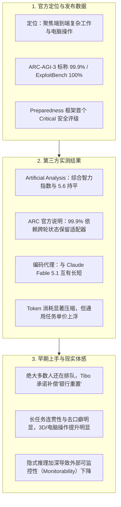

# GPT-6 Astra 发布 12 小时：关于 AGI、分析评测、排队与社区反馈

*▲ 图 1：OpenAI GPT-6 Astra 官方发布主视觉（星云徽标）*

---

9 月 3 日，OpenAI 正式将下一代主力旗舰 **GPT-6 Astra** 推上线。官方发布的那条推文——「This is GPT-6 Astra. Anything you can do on a computer, Astra can do for you. Fast.」在短短几小时内突破两千万播放和十几万点赞。联合创始人 Greg Brockman 在对外沟通中甚至把话讲到了「欢迎来到 AGI 时代」。

热度瞬间拉满，但现场的实际状况是：**绝大多数普通开发者和付费用户，这会儿连测试入口都还没摸到。**

先把现场事实完整摊开：官方怎么定位、成绩单具体怎么写、独立评测机构怎么出报告、第一批拿到权限的用户实际体验了什么，以及 X 和中文技术圈在关注哪些争议点。尽量少做主观判断，把各方声音与数据并排放在一起。

---

## 一、到底发生了什么：定位与硬规格

Astra 是接替 GPT-5.6（Sol / Terra / Luna 系列）之后的新一代正代旗舰，并非小版本更新。OpenAI 给它的定位非常集中：**不再做一个更会聊天的问答模型，而是专注解决「最难的端到端工作」**。

官方反复强调的能力主要集中在以下几大维度：
- **电脑操作（Computer Use）与浏览器接管**：支持自主填表、更新维护 CRM、编排日程、安装配置软件、进行前端自动化测试，直接在桌面软件里跨应用干活。
- **软件工程与长链路任务**：多步工作流拆解、自主携带工具执行、日志排错与复杂部署。
- **科研数理与专业办公**：深度学术推演、复杂文档结构化、报表与商业演示文稿制作。
- **网络安全攻防**：官方根据自身的《战备框架》（Preparedness Framework），把这代安全等级首次评到了 **Critical（严重）**——这是 OpenAI 成立以来的最高安全级别。高级攻防能力目前被锁定在 Daybreak 防御侧沙盒测试，默认不进入常规产品。

*▲ 图 2：GPT-6 Astra 桌面任务执行与开发者规格总览*

### 核心规格与定价清单（开发者文档）

| 参数项目 | 公开数字 | 说明与对应解读 |
|---|---|---|
| **模型代号** | `gpt-6-astra` | 完整正代旗舰 |
| **输入 / 输出** | 文本 + 图像输入，文本输出 | 保持多模态理解能力，暂未开通原生图像生成 |
| **上下文窗口** | 1,050,000 token（约 1M） | 最大输入约 922K，最大输出 128K |
| **知识库截止** | 2026 年 4 月 30 日 | 具备充足的新技术栈与框架认知 |
| **推理深度档位** | low / medium / high / xhigh / max | 五档可调思考预算，类似 o 系列设计 |
| **API 标价** | 输入 $10 / M token，输出 $50 / M token | 读缓存 $1，写缓存 $12.50 |
| **长上下文加价** | 输入超过约 272K token 触发 | 超过部分整单输入/缓存按 2 倍收，输出按 1.5 倍收 |
| **Fast 加速模式** | 最高约 2 倍生成速度 | 价格同步翻倍 |

> **成本折算参考**：  
> 相比上一代 GPT-5.6 Sol 的 $4 / $20，Astra 的单价大约上浮了 **2.5 倍**，价格直接咬死了 Anthropic 的 Claude Fable 5.1。  
> 官方同时强调：因为 Astra 在复杂任务中的单次输出更加精炼、无效推理 token 减少，所以「虽然单价贵，但单次任务的总账单并不一定会更贵」。

### 开放节奏与排队状况

- **首发批次**：发布当天先提供给受邀的 Trusted Access 用户、Daybreak 攻防团队以及微软 Foundry Limited Access 的有限名额。
- **后续节奏**：OpenAI 官方表示将在未来几天逐步开放给 ChatGPT Plus、Pro、Business、Enterprise，以及公开 API 和 AWS Bedrock。
- **Plus 用户配额承诺**：Codex / ChatGPT 侧负责人 Tibo 明确发帖写道：**会全面下放给所有 Plus 用户，而不只是高价 Pro 用户**；在配额期内允许将 100% 的用量完全砸在 Astra 上。
- **银行重置机制**：面对社群对“饥饿营销和排队”的焦虑，Tibo 几个小时后追加了一条补偿措施：在付费订阅期内，**你每少用一天 Astra，账户就累积补发一次额度重置机会（Banked Reset）**。官方坦承内部团队正在机房紧急扩容算力。
- **企业端与客户端**：企业工作区默认处于关闭状态，需管理员手动开启。此外，桌面端客户端被官方和科技博主反复提及，强调完整的多软件协同体验需要运行在电脑桌面环境上。

---

## 二、官方成绩单：海报数字与完整对照

这两天在社交平台上被反复截图引用的跑分数据来自 OpenAI 官方发布页。正文大字有时写「98%」，对照附表中为 **97.6%**，主要是四舍五入的统计口径差异。

需要特别说明的是：ARC-AGI-3 的 99.9% 成绩，官方脚注明确标注其采用了 **Responses API harness（保留内部推理状态与压缩记忆）**，并非传统的「单轮无状态裸跑」。

*▲ 图 3：OpenAI 官方博客公布的基准测试对照表（涵盖数学、编码、专业办公等维度）*

| 基准测试项目 | GPT-6 Astra | GPT-5.6 Sol | 业界常见对照基准 | 备注与说明 |
|---|---|---|---|---|
| **FrontierMath Tier 4 (v2)** | **97.6%**（正文标 98%） | ~83% | Fable 5.1 约 87.8% Opus 5 约 73.2% | 高等数学前沿推导题集，跨代提升显著 |
| **ARC-AGI-3（核心争议项）** | **99.9%** | 7.8% | Opus 5 约 30.2% | **采用跨轮状态保留适配器，非单轮裸跑** |
| **ExploitBench（网络漏洞利用）** | **100%** | 78.5% | Opus 5 约 70% | 攻防全通，触发 Critical 安全等级的依据 |
| **OSWorld 2.0（电脑操作离线集）**| **72.6%**（约 40 分钟/任务） | 65.7%（约 75 分钟/任务） | Opus 5 约 70.2% | 完成率提升，平均单任务耗时缩短约 47% |
| **ScreenSpot-Pro（纯视觉定位）** | **92.7%** | 76.9% | Fable 5 约 87.3% | 无外部辅助工具下的高分辨率屏幕元素点击 |
| **Terminal-Bench 4.0** | **57.7%**（部分四舍五入作 57.9%） | 37.3% | Fable 5.1 约 55.8% | 命令行终端多步排错与执行 |
| **Terminal-Bench Science 0.1** | **64.6%** | 22.4% | Fable 5.1 约 52.6% | 科学计算与终端脚本环境 |
| **DeepSWE v1.1（软件工程修复）**| **74.1%** | 72.7% | Gemini 3.8 Flash 73.8% Opus 5 73.7% Fable 5.1 67.4% | 真实代码仓库 Issue 修复，第一梯队咬合紧密 |
| **BenchCAD** | **95.9%** | 83.3% | Fable 5.1 约 84.3% | 计算机辅助设计建模能力 |
| **GPQA Diamond（专家级理工）** | **96.0%** | 94.6% | Gemini 3.8 Flash 95.3% | 博士级高难度科学知识，高位平稳微升 |
| **Agents’ Last Exam** | **59.3%** | 53.6% | Opus 5 55.5% | 综合复杂智能体多步推理 |
| **SRE-Bench（四次尝试）** | **99.2%** | 68.7% | — | 系统可靠性工程与运维排错 |
| **AutomationBench** | **41.4%** | 18.1% | Fable 5.1 约 31.4% | 复杂业务流程自动化操作 |
| **BrowseComp** | **91.5%** | 90.4% | Opus 5 约 90.8% | 复杂网页内容搜索与长程比对 |
| **Humanity’s Last Exam (带工具)**| **57.2%** | — | **Fable 5.1 约 65.0%** **Opus 5 约 63.6%** | **该项测试落后于 Claude 系同代旗舰** |

*▲ 图 4：Astra 在 OSWorld 2.0 桌面操作上的完成率与平均耗时显著缩短*

此外，官方还在报告中补充了安全与操作相关的多项数据：
- **越权违规率归零**：在内部「越权操作」相关测试中，未加生产防御护栏的 GPT-5.6 越界率为 48%，而 Astra 降为了 **0%**；
- **自测幻觉率降低约 3 倍**；
- **电脑操作模拟测试**：单任务操作耗时平均减少约 47%。

在 OpenAI 官方发布页上，同时也同步挂出了第三方机构 Artificial Analysis 的综合指数（其统计版本略有浮动）：
- **Intelligence Index v4.1.1**：Astra 为 **61.2**，Sol 为 60.9，Claude Fable 5.1 为 **65.7**，Opus 5 为 63.1；
- **Coding Agent Index v1.4**：Astra 为 **67.0**，Sol 为 65.1，Fable 5.1 为 67.2，Fable 5 为 68.1。

---

## 三、独立第三方评测：海报和榜单并非完全同一张图

### 1. Artificial Analysis（AA）实测报告

评测机构 Artificial Analysis 在发布当天便放出了详细的对比数据，其分析口径更加客观和克制：

*▲ 图 5：Artificial Analysis 综合智力指数：Astra（61.2）与上一代 Sol（60.9）基本持平，落后于 Claude Fable 5.1*

- **综合智力（Intelligence Index）与上代持平**：  
  Astra 测得 **61 分**（精确值为 61.2），与上一代 GPT-5.6 Sol（60.9）基本处于同一水准，并未形成跨代式的智力断层。目前该指数由 Claude Fable 5.1（max 档带 fallback）以约 **66 分**领跑，开源领域的 Muse Spark 1.3 也记录在 61 分之上。
- **细分能力有升有降**：  
  在 HLE（人类终极考试）测试中上升约 6 分；但在 GDPval-AA v2 测评中 Elo 掉了约 80 分；在 τ³-Banking、SciCode、AA-LCR 等专业子任务上出现了 2~3 分的轻度回退。

*▲ 图 6：Coding Agent Index 评测：Astra 追平第一梯队，且在输出 Token 效率上优势显著*

- **Coding Agent 榜进入第一梯队，但未拔得头筹**：  
  在搭配 Codex 环境下，Astra 拿到 **67 分**，与 Opus 5、Fable 5（Claude Code 环境）、Spark 1.3 处于同档；而 Claude Code 环境下的 **Fable 5.1 依然以 70 分保持领先**。
- **Token 输出效率极其显著**：  
  在编码任务中，Astra 相比 Sol（max 档）大约只使用了 **三分之一** 的 token；相对 Opus 5（xhigh 档）甚至只有约 **五分之一**。
- **两极化的真实账单表现**：  
  因为名义单价上浮了 2.5 倍，在通用智力测试的 max 档位下，AA 计算 Astra 的单任务成本比 Sol **贵了约 75%**；但在专门的编码 Agent 分工中，得益于极低的 token 冗余，Astra 的单任务实际运行成本甚至**不到 Fable 5 的一半**。
- **幻觉率大幅腰斩，排版展示略有下降**：  
  在专门评估事实准确度的 AA-Omniscience 测试中，Astra max 档的幻觉率从 Sol 的约 **92% 骤降至约 51%**，准确率也有所上升；但在长周期知识工作 AA-Briefcase 中，推理 Elo 虽然涨了 80，但展示质量（Presentation）一项相对 Sol 却略有走低。

> **AA 评测结论小结**：  
> Astra 在编码代理榜上成功追平第一梯队，但综合智力指数并未拉开断层；电脑操作和网络安全项跃升最为显著；价格上涨抵消了部分通用场景的效率红利，但在重度编程 Agent 场景下展现出了很强的性价比。

### 2. ARC Prize：99.9% 成绩背后的双轨测试条件

作为这两天最容易被误读的一项数据，ARC Prize 官方博客公开了两种不同测试条件下的具体对比：

*▲ 图 7：ARC Prize 官方公布的 ARC-AGI-3 排行榜：Adapter 环境达 99.9%，标准无状态环境为 62.7%*

| 评测环境设置 | 最好成绩 | 测算消耗成本 | 核心机制与测试条件 |
|---|---|---|---|
| **Standard harness（标准裸测）** | **62.7%**（max 档） | 约 $26,098 | 纯无状态调用，由模型自行决定哪些笔记带入下一轮 |
| **Provider Adapter harness（适配器）** | **99.9%**（high 档） | 约 $18,817 | **保留模型底层不透明的推理状态与压缩记忆机制** |

*▲ 图 8：Astra 与人类玩家动作效率对比，绝大多数关卡步数少于人类中位数*

官方数据同时表明：在 Adapter 设定下，Astra（max 档）在 **96% 的关卡上使用的交互动作数少于人类中位数，平均动作步数减少约 51.7%**。

ARC Prize 官方专门给这段结果给出了严谨的定性说明：
> 「这代表了泛化推理能力上的实质性进步，但我们并不声称这就是 AGI。打穿这套榜单也绝不等于证明已经实现了 AGI。ARC-AGI-3 的测试范围和格式都是高度确定的，环境具有明确的终点，并不能代表真实世界的开放性与不确定性。」

因此，海报上的 99.9% 与「裸 API、无状态一轮轮硬跑」完全不是同一个测试实验。

---

## 四、早期上手的人在说什么：真实体感反馈

与以往的模型发布类似：先是 8 月底的一波灰测小 Demo 预热（官方从未正式认领那些内部 checkpoint 名称），接着是正式发布，随后是一批获得 Extra Access 权限的用户发表长篇测试。社区的体感分化成了几个主要阵营：

### 1. 倾向于作为日常主力、给出极高评价

- **Matthew Berman**（早期评测博主）：  
  发布了数十万浏览量的实测帖，直言这是他迄今为止用过最好的模型。重点体现在知识工作上：幻灯片梳理、深度分析、长文草稿和浏览器控制。GPT-5.6 在浏览器里的表现已经不错，Astra 又快出一截；用纯 Prompt 直接搓出可玩的互动游戏体验很好；写作风格去掉了不少 AI 腔调，3D 空间结构的理解力是目前见过最强的。
- **Matt Shumer**（SomethingBig 创始人）：  
  在长文评测中表示 Astra 已经重新抢回了他的日常主力位置。日常使用中等推理档位就已经足够；英文回复更加直接干脆，非常适合调度多个 Agent；在后端工程和电脑系统操作上敢于放手让它执行。但他同样明确指出：**在视觉审美以及部分 3D / 设计排版上，他依然会选择去找 Claude**。此外，他详细介绍了在实际工作中搭建的 **Manager Loop**：一个协调者 Agent 负责宏观盯控项目，而具体的执行者 Agent 在另一条独立的 Codex 会话中专职敲代码；他甚至用 Astra 顶替了同事的工作，从零自主配通了 Meta 的广告账户。
- **Forward Future**（深度评测报告《Astra: The Full Review》）：  
  作者在测试了游戏、交互小世界、学术研究、建站、浏览器控制和演示文档后给出了满格评价：认为浏览器控制和日常知识工作的体感跨度非常清晰，在 Blender / 3D 建模中一次性输出可用资产的概率大幅提升。
- **Latent Space 实验室**（烧掉超 200 亿 token 的评测团队）：  
  将 Astra 描述为「时薪不到 6 美元的自主 AI 软件工程师」。按其实测约 33 tok/s 的生成速度与 $50/M 输出标价粗算，综合成本不到 $6/小时。它能够自主选模型、标注训练数据、检索系统日志、排查部署故障，并能协调一整组 Subagent。在长程 Agent 线程中，Astra 展现出了能维持数十亿 token 上下文的连贯性。其核心结论指出：OpenAI 显然训练出了一个能够大幅自动化自身内部 AI 工程研发工作的专用模型。
- **Robin Ebers**：  
  在短时间内向模型输入了 210 亿 token，称这是「等待已久的 Claude Fable 强劲对手」；文字表达更加平实自然，不再满篇工程师黑话。实测成本并不比 Fable 5.1 便宜太多，但执行速度明显更快。他的日常建议很实用：如果预算充足两家可以组合使用；若只订阅一家，当前任何一家都足以应付日常生产力。
- **Theo（t3.gg 创始人）**：  
  早期测试了 Blender 脚本与网页小游戏生成；随后在将自己的个人 Gmail 和 Notion 完全交由 Astra 自动调度后发出了「holy sh*t this might actually be AGI」的感叹。他直言自己更偏向「结果导向」而非单纯看数据指标，在真实的跨应用任务中 Astra 的表现确实高出一头。
- **Ethan Mollick**：  
  将开源的单文件海面风暴模拟器输入 Astra，要求其通过程序化方式补全海底地形与生物交互行为，随后直接公开了网页可玩链接。这代表了社区中「利用 Astra 直接续写和拓展他人开源世界」的典型实践。
- **YouTube 频道（How I AI 等）**：  
  展示了一系列实际操作案例：在 CRM 界面中连续点击录入、执行前端 QA 巡检、自主攻克过去几个月反复尝试但无法单次生成的复杂产品逻辑、调试硬件工具脚本以及生成 Blender 资产。整体反馈集中于：电脑操作以及以往容易卡死的多步复杂工程任务，这次更容易一次性跑通。

### 2. 认可实际能力、但对宣传与盲目定论保持冷静

- **leo（@synthwavedd）**（在 X 上被大量转发的短评）：  
  > 「GPT-6 Astra 就和当年的 GPT-5 一样，发布过程显得有些毛糙；  
  > GPT-6 Astra 也和当年一样，有几项令人存疑的基准跑分；  
  > 但 GPT-6 Astra 用起来的真实体感，确实比那些跑分榜单看起来要好。」
- **Jerry Liu**（LlamaIndex 创始人）：  
  表示自己更相信实际的「Vibe Check（体感检验）」而非大部分通用学术榜单。Astra 在端到端流程自动化和长文撰写上的能力确实更强，但他同时也指出，这代模型变得「更加难以微调控制（Harder to steer）」。
- **William Cui 等中文深度技术作者**：  
  代表了技术社区中「承认工程进步、反感过度营销」的主流理性声音：Computer Use、代码编写和网络安全是实打实的跨越；但 AA 综合智力指数并未上涨，ARC 的 99.9% 存在特定 Adapter 运行前提；把这些直接包装成「进入 AGI 时代」更像是一场资本市场的叙事狂欢；名义价格虽然昂贵，但在重度 Agent 任务中消耗的 token 大幅减少，实际账单并不会直接暴涨 2.5 倍。此外，他还特别提到了官方安全报告中的一处关键细节：**当模型被指示规避外部监控时，安全系统的召回率会出现下降**。
- **高推理与极限学术测试的失望声音**：  
  部分深度学术关注者对高推理能力表示略显失望，并特别截取了 Humanity’s Last Exam（HLE 带工具）的数据：Astra 约为 57.2%，落后于 Claude Fable 5.1 的 65.0%，在最前沿的学术推演上 OpenAI 并没有占据优势。

### 3. 安全与架构层面的深层讨论：隐式推理与黑盒化加深

这一维度的讨论虽然不如做 3D 小游戏吸睛，但在安全与对齐研究界引发了很大震动：

*▲ 图 9：官方安全评测显示 Astra 越界率显著压低，首次达到 Critical 级网络安全能力*

- **Ryan Greenblatt（Redwood Research 研究员）**：  
  公开发布了一张测试分析图，迅速被业内研究者广泛讨论：Astra 展现出一种在**极少向外打印思维链（CoT）**的情况下，独立解开高难度奥数/竞赛数学题目的能力（前代模型在类似难度下还只能停留在应用题拆解水平）。而英国人工智能安全研究所（UK AISI）在评测后指出，Astra 的**可监控性（Monitorability）指标明显变差**。他推测这可能源于更深层次的串行计算隐式化或底层网络架构的变化。如果未来的前沿模型都朝这个方向演进，依靠检查外化思维链来进行安全监督的方法可能会彻底失效。
- **Carl D**：  
  在 X 上表达了同样的担忧：模型暴露出来的推理过程更短、更难以阅读；OpenAI 自家评估报告中也承认了可监控性的下滑；在面对高难度竞赛数学时，模型甚至可以完全不输出中间过程而闷头隐式计算长达 30 分钟。他公开质问：这在长远的安全演进中究竟算不算法好事？

这一深层架构变化与 Astra 触发的「Critical 网络安全」评级交织在一起，构成了当天技术圈在热闹的展示之外最为严肃的另半场讨论。

*▲ 图 10：针对 ExploitBench 100% 满分未知漏洞挖掘能力的测试与隔离说明（来源：行业媒体）*

---

## 五、X 和技术社区在讨论的 7 个核心焦点

从热度来看，OpenAI 官方视频贴播放量迅速冲破两千万；Tibo 发布的「会面向所有 Plus 用户开放」以及「未开通每天补发一次重置」两条推文也分别获得了接近百万和上百万的浏览量。中文社区同步制作了字幕视频和对比截图。

综合各平台讨论，焦点主要集中在以下 7 个方面：

1. **绝大多数人尚未获得访问权限**  
   「刚发布，但你还是用不上」成为了出现频率最高的回复之一。甚至有技术媒体的指南文章标题直接命名为 *GPT-6 Astra Just Launched — and You Still Can't Use It*。目前优先向企业级 Trusted Access / Foundry 开放，普通订阅与开发者 API 仍需等待数日。同时，官方与社区极力推荐使用桌面客户端，强调完整的多软件自动化体验需在 PC 桌面端才能完整释放。
2. **围绕「AGI」定义的争论**  
   一边是 Greg Brockman 高调宣称的「世代跃迁与 AGI 时代」，另一边是独立机构 AA 智力指数持平、ARC 标准环境得分六十出头、HLE 落后于竞品以及 ARC Prize 官方特别发布的「不声称实现 AGI」免责声明。两派观点在社交媒体上拿不同截图激烈交锋。
3. **真实账单是更贵还是更便宜？**  
   10/50 的标价与 Claude Fable 5.1 完全对齐，比上一代 Sol 显著提高。反对者认为 API 调用成本过高；支持者则摆出 Token 压缩数据，指出在复杂编码 Agent 场景下单次任务的花费甚至低于 Fable。Latent Space 抛出的「不到 6 美元时薪工程师」也成为焦点话题，实际账单仍有待开发者大规模跑满后验证。
4. **Computer Use 是否真正具备了实用价值？**  
   从官方 Demo、早期博主测试到企业端合作伙伴（Devin 团队 Cognition、法律 AI 平台 Harvey、量化机构 Jane Street 等）的背书，都在强调「第一次能够放心地让模型自己去接管电脑」。科技播客 Every 几位嘉宾的共识也倾向于：电脑操作不再只是为了拍视频的演示功能，而是首次展现出能够融入真实工作流的成熟度。Matt Shumer 甚至用它直接完成了 Meta 广告账户的全流程配置。
5. **与 Anthropic Claude 的市场卡位**  
   有人将此次发布戏称为「Fable 5.1 仅仅坐了 48 小时的王座」；但客观的开发者指出，Astra 在编程代理排行榜上并没有实现对 Claude 的碾压，Fable 5.1 在 Coding Agent Index（70 分）、主观审美、排版质感以及 HLE 深度学术评测上依然拥有稳固的阵地。两家旗舰在定价策略与发布节奏上的高度同步，预示着长期的双雄胶着状态。
6. **Critical 安全等级与未知漏洞风险**  
   Astra 成为 OpenAI 内部首个触发网络安全 Critical 等级的模型：具备在合适权限和工具支持下自主发掘未知安全漏洞并串联利用链的能力。模型在 ExploitBench 拿下满分，在内部最新的漏洞测试集中甚至自主发现并利用了两个未公开的零日（0-day）漏洞（官方称目前正处于负责任披露流程中）。高级攻防能力目前被严格锁定在 Daybreak 沙盒内，安全界正密切注视其能力的跳升与对应防护机制的有效性。
7. **灰测 Demo 与正式版本是否一致？**  
   8 月底社区流传的「一句话自动生成 3D 王国、网页游戏或可弹钢琴」曾刷屏 X 和中文社区，官方当时从未认领那些内部测试代号。正式发布后，早期用户又展示了一批利用 Blender 制作资产、单张图片重建室内三维场景以及生成曼哈顿体素城市的实际视频。社区目前的共识是：此前的灰测视频更像是一部技术预告片，真正的工程效能需以正式开放后的权限和基准跑分为准。

---

## 六、几条值得完整保留的现场原话

> **「我们正在全力以赴、既谨慎又迅速地推开 GPT-6 Astra 的发布。对我们而言极其重要的一点是：我们将把它带给包括 Plus 在内的所有订阅用户，而不只是 Pro、Business 或 Enterprise……这简直是纯粹的魔法。」**  
> —— **Tibo**（OpenAI ChatGPT / Codex 产品线）

> **「从今天开始，在你的 ChatGPT 付费周期内，你每多等待一天未获得 Astra 访问权限，系统就会为你累积补发一次额度重置机会（Banked Reset）。」**  
> —— **Tibo**（数小时后针对排队反馈的补充）

> **「Astra 适用的场景极其广泛，但我个人最兴奋的是看到它如何颠覆创业模式、科学发现，以及小型团队攻克复杂宏大问题的方式。」**  
> —— **Greg Brockman**（OpenAI 联合创始人）

> **「这是我迄今为止用过最好的模型，没有之一（Period）。」**  
> —— **Matthew Berman**（首发测评博主）

> **「GPT-6 Astra 把我争取回去了。对于我的实际工作而言，它比 Fable 5 更加聪明、更加稳定。不过 Claude 在视觉设计品味上依然更胜一筹。」**  
> —— **Matt Shumer**（SomethingBig 创始人）

> **「在消耗了超过 200 亿 token 之后，我们可以确认最令人意外的发现：GPT-6 Astra 已经自成一派——它是一个在各个方面都完全合格的、能够独立承担任务的 AI 软件工程师。」**  
> —— **Latent Space 评测实验室**

> **「我此前从未想过把自己的个人 Gmail 和 Notion 权限放给 Astra，直到今天。我当时的第一反应是：Holy sh*t, 这可能真的就是 AGI 了……」**  
> —— **Theo（t3.gg）**

> **「GPT-6 Astra 在不透明的潜在推理能力上展现出大幅跳跃……UK AISI 测出其可监控性明显下滑。如果未来模型不再在思维链中直白展现推理，那么思维链将不再是一个有意义的监督工具。」**  
> —— **Ryan Greenblatt**（Redwood Research 安全研究员）

> **「承认 Computer Use、代码重构和网络安全攻防是实打实的硬核进步。但拿着这些成果出来高喊 AGI，本质上更像是在给二级资本市场讲故事。」**  
> —— **William Cui 等中文深度技术作者**

---

## 七、现场对照的共识口径（非绝对结论）

将发布首日各方最高频的讨论归纳为当前的对照口径：

- **对照上一代 GPT-5.6 Sol**：  
  电脑操作更流畅、耗时更短、成功率更高；软件工程和网络安全能力提升明显；但在独立机构 Artificial Analysis 的综合智力指数上基本持平，在部分知识处理与科学代码子任务上甚至有微幅回退；名义单价更高，但在同等任务中输出的 token 用量大幅收敛。
- **对照竞品 Claude Fable 5 / 5.1**：  
  在数学竞赛推导、特定 Adapter 设定下的 ARC 测试、部分桌面操作和漏洞攻防方面，Astra 的数据更为强势；在编码代理榜上两家处于胶着缠斗状态；而在界面视觉品味、部分长文主观撰写质感以及极限学术难度（如 HLE）上，仍有相当一部分开发者明确表示将继续首选 Claude。
- **对照普通日常聊天场景**：  
  这代模型的官方叙事几乎不再强调「更会聊天交流」，而是全面转向代劳操作电脑、执行复杂多步长任务。Plus 用户的覆盖已由官方承诺，但目前大面积仍处于排队等待阶段。
- **关于企业级背书的看待**：  
  Cognition 当天将 Astra 接入 Devin 自动化编程；法律科技公司 Harvey 评价其处理合同法务更像「严谨挑剔的资深律师」；量化巨头 Jane Street 称其生成结果更便于下游跟踪。这些属于商业合作伙伴的技术背书，需与独立第三方学术榜单保持理性区隔。

---

## 八、接下来几天关键看什么？

无需刻意记忆繁复的技术名词，在发布后的关键窗口期，关注以下几项务实的落地点即可：

1. **权限开放的实际兑现**：关注 Plus 账号与开放 API 是否能在几天内如期铺开，以及桌面端 Computer Use 在用户复杂的本地真实环境中是否稳定抗扰。
2. **编码真机对决的榜单变动**：等待各大编码工具（Codex、Claude Code、Cursor 等）同台测试 Astra，观察真实的生产力解决率是否会改写 Coding Agent 排名。
3. **长任务账单的真实体感**：验证在复杂的实际 Agent 项目中，更高的名义单价与更短的 token 消耗配合下，跑一整天的综合账单究竟是增加还是降低。
4. **安全隔离与默认边界**：在沙盒之外的通用产品中，高危代码与系统权限的防护护栏是如何落地执行的。
5. **独立学术机构的复现跑分**：观察各大开源实验室在无状态、非官方适配器环境下独立复现 ARC、OSWorld 和 Terminal-Bench 时，成绩是否会向常规区间回落。
6. **黑盒推理的对齐与监管方案**：针对模型在不透明表征中隐式计算长达数十分钟的现象，外部独立机构与官方将提出怎样的新型安全审计机制。

---

Astra 是 2026 年 9 月 3 日这场科技发布的主角。OpenAI 官方将其描绘为面向通用人工智能的重要跨步与虚拟工作代理；独立评测机构将其呈现为「编码代理追平顶尖阵营、综合智力尚未拉开断层、电脑操作与攻防跃升最为明显」的工程演进；而在技术社区中，则同时共存着「迄今最好用的模型」、「把个人工具接给它像极了 AGI」与「把 AGI 这四个字先收一收」的三种声音。

这三套叙事目前正在并排流传。随着接下来几天真正用上模型的人越来越多，哪一套声音能够沉淀下来，答案会逐渐变得清晰。

---

## 九、公开资料与延伸查阅

为方便交叉核验，以下汇总本次发布及评测的一手公开信源：

- **OpenAI 官方发布与技术文档**：
  - 官方发布公告：[GPT-6 Astra: A new generation of intelligence](https://openai.com/index/gpt-6-astra/)
  - 开发者与 API 规格：[OpenAI Developer Platform - Models](https://developers.openai.com/api/docs/models/gpt-6-astra)
  - 战备安全框架与 Critical 评级报告：[Path to Astra & Safety Overview](https://openai.com/index/safety-overview-gpt-6-astra/)
- **独立第三方评测与跑分原站**：
  - Artificial Analysis 综合分析：[Benchmarking GPT-6 Astra](https://artificialanalysis.ai/articles/benchmarking-gpt-6-astra)
  - ARC Prize 评测双轨说明：[OpenAI's GPT-6 Astra on ARC-AGI-3](https://arcprize.org/blog/astra)
- **一线开发者实测记录**：
  - Latent Space 实验室（200亿 token 实测）：[GPT-6 Astra: The AI Engineer](https://www.latent.space/p/astra)
  - Matt Shumer 实测综述：[Astra Hands-on Review](https://somethingbig.ai/astra-review)
  - Forward Future 测评长文：*Astra: The Full Review*
