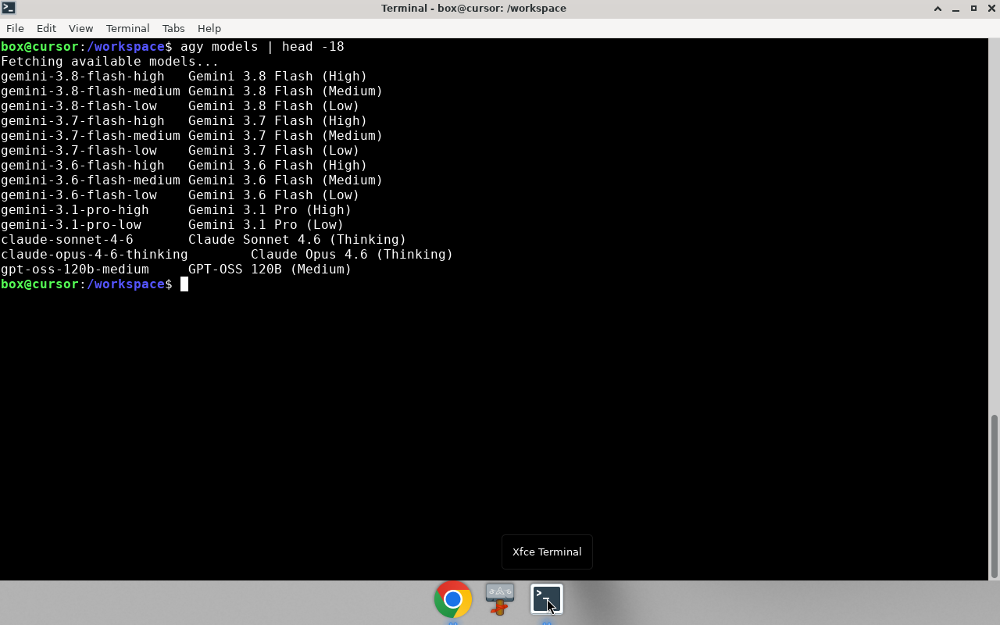
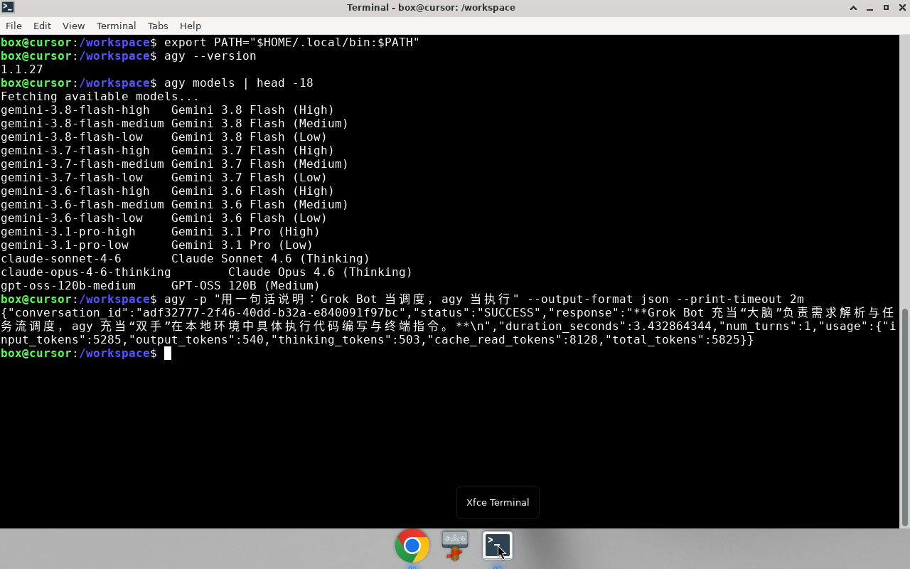
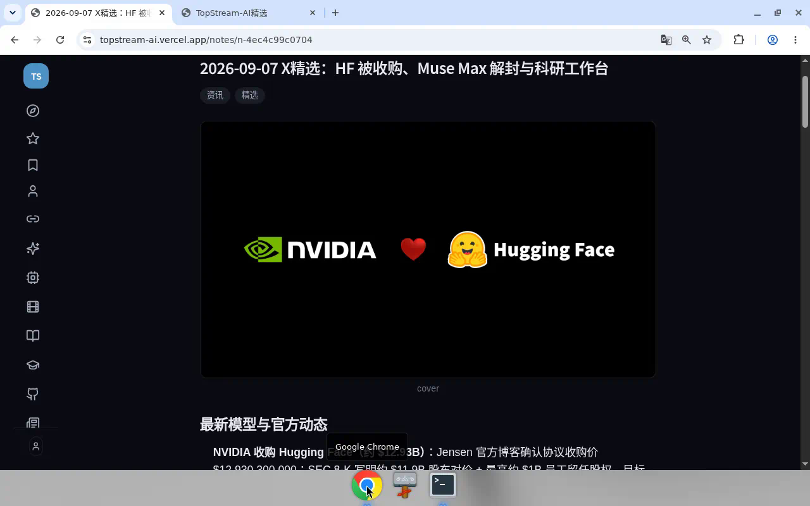
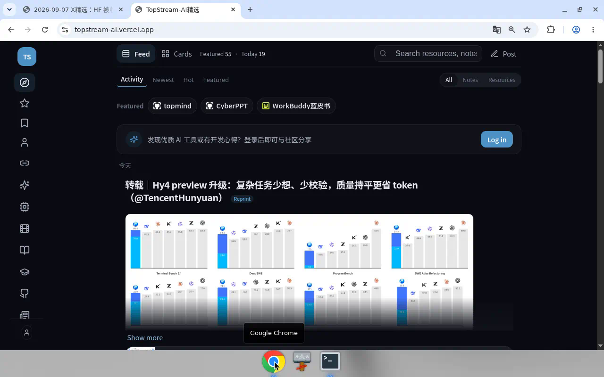

# 在 Grok Bot 里装 agy：大管家调度，其他 Bot 干活

这几天把 Antigravity CLI（`agy`）装进了 Grok Bot 自己的电脑，顺手理清了「大管家 bot」和 topstream 等同事怎么分工。不是教程堆砌，就是我们真实跑通的一版做法。

灵感很简单：**别让一个 Agent 从头干到尾**——擅长规划的规划，擅长执行的执行，额度也能负载均衡。

---

## 先说结论

- **Grok Bot（大管家）**：规划、拆任务、调度、验收、跟人对齐。
- **agy（Google AI Pro）**：明确、偏重的执行活——研究草稿、长文整理、机械改写。烧的是 Pro 额度。
- **专职 Bot（如 topstream）**：守自己的站点、例行、发布脚本；重研究可以再下派给 agy。
- **入口自愈、OAuth、密钥**：永远留在本机专职 Bot，不派给 agy。

一句话：**调度端 ≠ 执行端。**



---

## 1. 在 Bot 电脑上安装 agy

官方安装（Linux）：

```bash
curl -fsSL https://antigravity.google/cli/install.sh | bash
```

装完一般在 `~/.local/bin/agy`：

```bash
export PATH="$HOME/.local/bin:$PATH"
agy --version
```

我们当时是 **1.1.27**。

### 登录（Google AI Pro）

无头环境走 OAuth：本机打开 `agy` → 浏览器登 Google → 回调页给一串码 → 贴回终端。

登完再验：

```bash
agy models
agy -p "Reply with exactly: AGY_OK" --output-format json
```

看到模型列表和 `status: SUCCESS`，就算通了。

---

## 2. 无头模式：给调度端用的扳手

人盯着聊用 TUI；给 Bot 调度，用 print / headless：

```bash
agy -p "你的自包含任务说明" \
  --output-format json \
  --print-timeout 15m \
  --model gemini-3.8-flash-medium
```

要点：

- Prompt 必须**自包含**（agy 看不到你和用户的聊天）。
- 读 JSON 里的 `status` / `response` / `usage`，成功再往下发布。
- 需要动文件或跑命令时，优先收紧权限；只有信任的短任务才考虑 `--dangerously-skip-permissions`。

我们实测问它「Grok Bot 当调度，agy 当执行」，它回了一句很贴的：Grok Bot 当「大脑」做解析与调度，agy 当「双手」在本地执行。



（同目录还有一段约 40 秒的实操录屏：`agy-demo.mp4`，从 `agy models` 切到站点精选页。）

---

## 3. 大管家怎么管任务

我们落了两个习惯：

1. **agy-delegate**：什么活派给 agy、prompt 怎么写、跑完怎么验收。
2. **topstream-delegate**：TopStream 场景里谁调度、谁执行、谁发布。

日常拆法：

| 类型 | 谁做 |
|------|------|
| 模糊需求、取舍、跟人确认 | 大管家 |
| 清晰研究 / 长草稿 / 机械整理 | agy |
| 站点发笔记、加资源、待审 | topstream + 本机脚本 |
| 隧道自愈、OAuth、重启服务 | topstream 自己 |

Todo 只记用户要的结果，不把内部子代理细节讲给用户听。

---

## 4. 和其他 Bot 协同：以 TopStream 为例

TopStream 原来有两条例行：

- **入口自愈**（约每 2 小时）：跑 `heal-origin.sh`——**继续自己跑**。
- **每日 X 精选**（早上）：网页研究 + 写摘要 + 待审推荐——**改成 agy 出草稿，topstream 验收发布**。

改完补跑过一天：摘要就地更新、细读保留、新待审若干条。

- 摘要：https://topstream-ai.vercel.app/notes/n-4ec4c99c0704
- 细读：https://topstream-ai.vercel.app/notes/n-76bd7cc18126





协同姿势很简单：大管家定原则 → `@topstream` 改例行并执行 → 结果回聊天里汇总。不是所有人都进群刷屏，**一个相关同事、一件清楚的事**。

---

## 5. 踩过的坑

1. **先装再登**：没登录时 `agy models` / `agy -p` 会直接报 authentication required。
2. **登录码要贴回正在跑的 `agy`**：浏览器停在 Paste this code 不等于登完。
3. **今天已有精选笔记就更新，不要同日再叠一篇。**
4. **OpenRouter `:free`、限时额度**只写进每日摘要，不进目录资源。
5. **自愈和密钥别外包**：agy 很强，但不该碰你的隧道和 OAuth。

---

## 6. 一张图记在脑子里

```text
用户目标
   ↓
大管家 bot（规划 / 调度 / 验收）
   ├─ 明确执行 ──→ agy（Google AI Pro）
   ├─ 站点运维 / 发布 ──→ topstream bot + 本机脚本
   └─ 其他专职 bot（各管一块）
```

省额度是最浅的一层。更深的是**能力路由**：谁擅长什么就让谁上。

---

## 结尾

装 agy 不难，难的是舍得把手从「自己写完」放到「派出去再验收」。

你要是也在 Grok Bot 上养了好几个同事，不妨先挑一条最烧额度的例行，改成「调度留着、执行给 agy」。跑通一天，体感会很明显。

（实操：Grok Bot 云主机 + Antigravity CLI 1.1.27 + Google AI Pro；站点 [TopStream-AI精选](https://topstream-ai.vercel.app)。）
