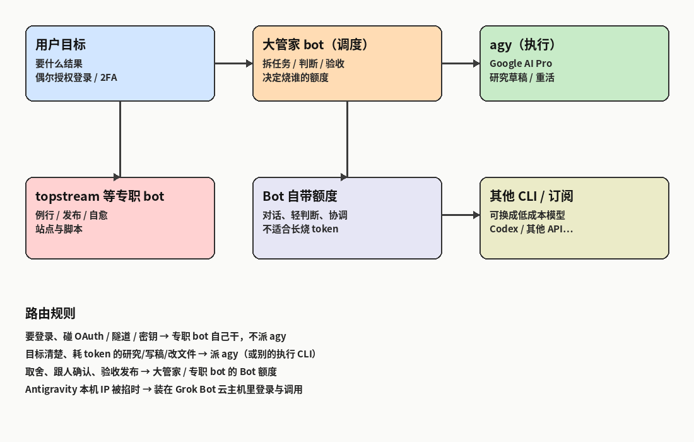

# Grok Bot多Agent调度尝试，完美解决Antigravity使用问题，优化token利用

Antigravity（下文都叫 `agy`）最近封控、限 IP 挺狠。本机经常登不上，或者好不容易登上了，换个网络环境又掉回认证页。

前几天我把它整个搬进了 **Grok Bot 自带的云主机**，顺手把几个 Bot 之间的分工重排了一遍。跑下来效果比预想的好：认证问题基本消失，长任务不再烧 Bot 自己的额度，整体反而更省。

这篇记录的就是这次改造——怎么装的、活怎么派、额度怎么算。



---

## 一、两个麻烦，其实是同一件事

回头看，之前难受的地方有两处，而且互相加重。

**一是认证不稳。** 本机跑 `agy`，登录态跟机器环境绑得死。IP 一变、环境一换，就得重新走一遍 OAuth，有时候干脆卡在半路。

**二是额度全压在一处。** 那会儿习惯是：一个 Bot 从听需求、查资料、写长稿到发布，全程自己干。研究和长草稿是最吃 token 的活，全记在 SuperGrok 头上，额度掉得很快，还拖慢了本来该轻快完成的协调类任务。

后来想明白：这两个问题的解法是同一个——**把执行挪到稳定的环境里，把重活挪到更合适的额度上。**

---

## 二、把 agy 装进 Grok Bot 的云主机

Grok Bot 给每个 Bot 都配了持久的 Linux 环境，这一点是关键。装一次、登一次，之后就是常驻的。

装完之后，调度端不需要任何交互，直接一条命令：

```bash
export PATH="$HOME/.local/bin:$PATH"
agy -p "自包含任务" --output-format json --print-timeout 15m
```

这条命令里三个地方是有意的：

- `-p` 是无头模式，不带交互，适合被别的 Bot 调用；
- `--output-format json` 让结果结构化返回，下游拿到直接解析，不用再从自然语言里抠信息；
- `--print-timeout 15m` 给长任务留足时间，短任务可以调小。

代价是：`-p` 收到的指令必须是**自包含**的。它不知道你前面聊了什么，路径、成功标准、不要做什么，都得在这一段里写清楚。这也反过来逼着我把任务定义得更明确。

我装的是 **1.1.27**，用 Google AI Pro 登录后，`agy models` 和无头 `-p` 都验证通过。


云主机出口固定，登录态不会跟着你本机的网络切换而失效——这才是“认证稳了”的真正原因。

---

## 三、谁干什么，就烧谁的额度

分工定下来之后，整套东西才真正跑顺。目前是这样：

| 谁 | 干什么 | 烧什么 |
|---|---|---|
| 大管家 bot | 听需求、拆任务、派人、验收 | Grok Bot 额度（轻量） |
| topstream 等专职 bot | 例行、发布、自愈、守自己的站 | 同上；重活再往下派 |
| `agy` | 研究、长草稿、明确的执行 | Google AI Pro |
| 以后别的 CLI / API | 可替换的执行层 | 你自己的低成本订阅 |

一句话概括判断标准：

- **Bot 额度**留给对话、判断、协调，以及“点一下发布脚本”这种轻动作；
- **agy 或其他执行端**接目标清楚、会啃很多 token 的活；
- **碰登录、OAuth、隧道、密钥的活**，一律专职 Bot 自己来，不派给 agy。

最后这条不是洁癖，是职责边界：凭证相关的操作留在离你最近、你最能掌控的那一层。

原则就一句：**调度留在 Grok Bot，执行花在更合适的那份订阅上。**

---

## 四、什么时候派活，四条就够

实操下来，判断规则其实很简单：

1. **还没想清楚要什么** → 先跟大管家聊，别开 `agy`。
2. **需求已经能写成一段完整指令**（路径、成功标准、别做什么都写清）→ 派 `agy -p`。
3. **要发站、改例行、修隧道** → 交给 topstream 这类专职 Bot；草稿可以让 agy 写，发布脚本在自己这边跑。
4. **只需要人点一下确认**（登录、2FA）→ 把桌面交还给你，Bot 不碰密码。

第 2 条是分水岭。写不出完整指令，说明任务还没定义清楚，这时候派出去，多半是浪费一轮额度换回一堆要返工的东西。

---

## 五、实例：「每日 X 精选」改造前后

拿 TopStream 的「每日 X 精选」举个具体例子。

**改造前：** 研究和写作全压在一个 Bot 身上。它得先翻一批内容，再自己提炼、成稿，全程都是高消耗对话，额度烧得很快。

**改造后：** agy 负责出研究草稿，topstream 负责验收、去重、发布。前者干重活但花的是 Google AI Pro 的额度，后者干轻活，动作快、成本低。入口自愈这类对站点状态有依赖的活，仍然由 topstream 自己跑，不外派。


改动不大，但额度曲线明显平缓了，而且出稿速度没受影响。

---

## 六、执行层不用绑死 agy

`agy` 只是这会儿最好用的那个执行端，不是唯一选择。同一套调度逻辑，重活也可以指向别处：

- 别的官方 CLI，只要有 headless / print 模式就行
- 便宜的 API 额度，或者按量计费的模型
- 本机脚本 + 小模型，做机械性的整理、归类

只要接口是“丢进去一条自包含指令、拿回来一个结构化结果”，就能挂进这套调度里。以后哪家更划算，就换哪家，调度层不用动。

---

## 七、顺带一提：这篇是怎么出来的

这篇文章本身也是这套流程的产物：大管家起草 → 桌面截图/录屏 → topstream 推到 `topmindspace/topstream` 并同步站点。

我参与的部分，主要就是 Google 登录那几次授权。录屏在同目录 `agy-demo.mp4`，比文字直观。

- GitHub：`notes/grok-bot-agy-delegation-and-multi-bot.md`
- 站内同步更新同一篇


---

## 写在最后

回头看，这次折腾真正的收获不是“把 agy 装上了”，而是想清楚了一件事：**Agent 的调度和执行，本来就该是两层。**

调度层要的是轻、快、可控，所以留在你信得过、额度珍贵的那个 Bot 上；执行层要的是便宜、能扛重活，所以哪份订阅合适就用哪份，随时可换。

如果你手上也同时有几份订阅，却总觉得某一个额度掉得特别快，可以试试这个拆法。有更好的分工思路，欢迎在评论区聊聊。

