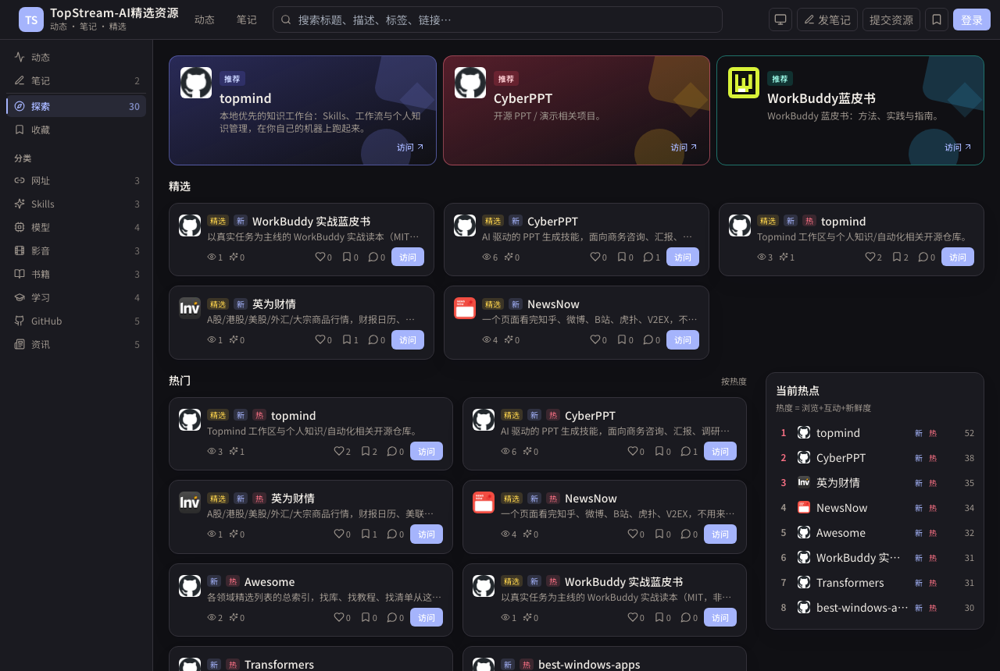

# 2小时上线一个全功能Web应用：我和Grok Bot的真实实战与深度复盘

昨晚折腾到深夜，终于把构思了一阵子的站点彻底上线了：[TopStream-AI精选资源](https://topstream-ai.vercel.app)。

说实话，动手前我预期的上限不过是用 AI 快速揉一个静态页面 Demo，然后自己再慢慢改。但最后的结果**大大超出了我的预期**——从第一句“想做个展示站”的想法，到完成整个 Next.js 全栈应用、SQLite 数据库设计、公网稳定访问、打通 GitHub / Google / X 三方登录、搭建好管理后台，并顺手配置了几个自动化对话运维脚本，**整个过程前后只花了大概 2 小时，耗费了 SuperGrok 大约 30% 的用量额度**。

代码和全套记录我也直接开源了：[github.com/topmindspace/topstream](https://github.com/topmindspace/topstream)。

这次折腾让我对 AI 辅助编程有了全新的认识。这里不想聊那些虚头巴脑的 Prompt 技巧，直接把我踩过的坑、具体怎么一步步把站点推到公网的完整过程，以及对 Grok Bot 的一手心得，原汁原味地记下来。

---

## 成品先睹为快

站点不是那种泛滥的网址导航，核心是我自己日常高频翻阅的 AI 工具、开源项目、硬核研报与学习笔记的集合流：

**这 2 小时里跑通的功能包括：**
- **分类与筛选**：网址、Skills、模型、GitHub、影音、书籍等多维度分类，支持标签筛选与全站即时搜索。
- **互动机制**：卡片支持点赞、收藏与多层评论（未登录可以先在本地暂存，登录后自动合并到用户账号下）。
- **投稿与审核**：普通访客可以提交资源，后台提供专用的待审列表，支持一键通过或填写原因驳回。
- **笔记模块**：不仅能写 Markdown，还能直接通过 GitHub Raw 链接远程拉取并渲染仓库里的文档。
- **三方账号体系**：无缝支持 GitHub、Google、X 快捷登录，管理员账号自动识别与后台白名单鉴权。
- **对话式运营（技能）**：把“发新资源”和“发新笔记”做成了命令脚本，后面我只要在聊天框里跟 Bot 聊一句，它就能直接入库发布，根本不用手动登后台填表单。

---

## 完整的五步实战全流程

### 步骤 1：别写死板的 PRD，用已有素材边聊边长出 MVP

以前开发习惯先写好详尽的接口和需求文档，但这次我试了一种更直接的打法：**用手头现成的真实数据当种子**。

我把自己本地工作区里日常记录的几个核心信息源（比如 NewsNow、CyberPPT、各类研报站点等）直接丢给 Grok Bot，开门见山地说：
> “我手头有这几个分类的资源，帮我做个现代质感的 Web 资源站，要能支持分类、搜索，别人打开就能用。”

Bot 收到后没有机械地直接丢几段代码让我去贴，而是主动追问了关键细节：
- 卡片点开是弹窗看详情还是直接跳出？
- 要不要给用户点赞、收藏的能力？
- 界面喜欢什么样的风格（沉稳暗色还是亮色卡片）？

对齐思路后，Bot 直接在它的云端环境里完成了 Next.js 14、Tailwind CSS、Prisma 和 SQLite 的项目脚手架搭建。前后不到 20 分钟，一个不仅有前端布局、连数据库表结构和测试数据都跑通的原型就运行起来了。

---

### 步骤 2：云主机常驻 + Vercel 反代，彻底钉死公网入口

应用跑在 Grok Bot 自带的那台持久 Linux 云主机上，数据库是轻便的本地 SQLite。这时候面临一个很现实的技术选择：**怎么向公网暴露服务？**

很多人可能会直接走 Cloudflare 临时穿透隧道（Quick Tunnel），这确实能秒出公网链接，但有一个致命痛点：**临时隧道的子域名每次重启都会变**。
一旦域名变动，发给别人的链接会失效，更致命的是，**第三方 OAuth 登录的回调地址会直接彻底报废**。

为此我们设计了一套极其轻巧稳定的架构：
1. **云主机负责业务和数据**：应用进程和 SQLite 数据库留在这台一直亮着的云端主机上，本地性能好，数据文件实打实落在磁盘上。
2. **Vercel 当作固定的前门反代**：
   - 在 Vercel 上创建一个极简项目，配置 `vercel.json` 的 `rewrites`，把所有的请求反向代理到云主机当前的穿透出口上。
   - 固定的对外域名钉在 `https://topstream-ai.vercel.app`。
3. **收益**：所有的外部用户访问、浏览器书签以及三方 OAuth 回调统一认准这个固定域名。即使哪天底层穿透通道重连、隧道域名变了，我只需要改一下 Vercel 反代指向的上游源，对外服务和登录系统完全不需要任何变动，稳定性拉满。

---

### 步骤 3：接入三方 OAuth 登录，人机分工与避坑实操

接入登录是整个流程里最需要“人机配合”的一环。原则很清楚：**需要账号所有权和人肉点按的交给人类，底层协议对接、避坑和环境配置交给 Bot。**

这次我们一口气打通了 GitHub、Google 和 X（Twitter）三个登录通道，下面是每个平台详细的后台设置路径与对应配置：

#### 1. GitHub 登录
- **访问后台**：登录 GitHub -> 右上角头像 **Settings** -> 左侧拉到底进入 **Developer settings** -> 点击 **OAuth Apps** -> 点击 **New OAuth App**（直达链接：`https://github.com/settings/applications/new`）。
- **操作项与填写**：
  - `Application name`：填写你的应用名称，如 `TopStream-AI`。
  - `Homepage URL`：填写站点首页 `https://topstream-ai.vercel.app`。
  - `Authorization callback URL`：必须严格填写 NextAuth 约定的路由：`https://topstream-ai.vercel.app/api/auth/callback/github`。
- **获取密钥**：
  - 点击注册后，页面会给出 **Client ID**。
  - 点击 **Generate a new client secret** 生成一串密文，即 **Client Secret**（记得立刻复制，刷新后不再显示）。
- **应用环境变量**：
  - `AUTH_GITHUB_ID`
  - `AUTH_GITHUB_SECRET`

#### 2. Google 登录
- **访问后台**：进入 [Google Cloud Console](https://console.cloud.google.com/) -> 选择或新建一个项目。
- **配置同意屏幕（首次必做）**：
  - 侧边栏进入 **APIs & Services（API 与服务）** -> **OAuth consent screen（OAuth 同意屏幕）**。
  - 用户类型选 **External（外部）**，随便填个应用名称和开发者联系邮箱，保存即可。
- **创建凭据**：
  - 侧边栏点击 **Credentials（凭据）** -> 点击上方 **+ CREATE CREDENTIALS** -> 选择 **OAuth client ID**。
  - `Application type`：选择 **Web application**。
  - **Authorized JavaScript origins（已获授权的 JavaScript 来源）**：**这里极度容易漏掉**，必须添加 `https://topstream-ai.vercel.app`，否则前台唤起登录会报跨域错误。
  - **Authorized redirect URIs（已获授权的重定向 URI）**：添加 `https://topstream-ai.vercel.app/api/auth/callback/google`。
- **获取密钥**：创建成功后弹窗复制 **Client ID**（通常以 `.apps.googleusercontent.com` 结尾）和 **Client Secret**。
- **应用环境变量**：
  - `AUTH_GOOGLE_ID`
  - `AUTH_GOOGLE_SECRET`

#### 3. X (Twitter) 登录
- **访问后台**：进入 [X Developer Portal](https://developer.x.com/en/portal/dashboard) -> Projects & Apps 下选择你的应用（若无则先创建 App）。
- **配置用户授权**：
  - 进入 App 的 **Settings** 选项卡，向下滚动找到 **User authentication settings**，点击 **Edit** 或 **Set up**。
  - `App permissions`：勾选 **Read** 权限即可。
  - `Type of App`：务必选择 **Web App, Automated App or Bot**（这样才会开启 OAuth 2.0 授权机制）。
  - `App info` 配置项：
    - `Callback URI / Redirect URL`：填写 `https://topstream-ai.vercel.app/api/auth/callback/twitter`。
    - `Website URL`：填写站点网址 `https://topstream-ai.vercel.app`。
- **获取密钥与避坑要点**：
  - 保存后页面会展示 OAuth 2.0 的 **Client ID** 和 **Client Secret**，必须把这一对复制保存下来。（**注意**：不要误用最外层仪表盘的 API Key & Secret，那是用于 OAuth 1.0a 的）。
  - **避坑点**：Auth.js 默认的 Twitter Provider 对 Client Secret 的传递方式有兼容要求。在联调过程中，Bot 敏锐地抓到了 Basic 认证头失败的报错，在服务端主动补齐了正确的授权请求头转换，才顺畅跑通。
- **应用环境变量**：
  - `AUTH_TWITTER_ID`
  - `AUTH_TWITTER_SECRET`

#### 4. 安全把密钥注入环境
除了上面的凭据，Auth.js 还需要两个全局变量：
- `AUTH_URL=https://topstream-ai.vercel.app`
- `AUTH_SECRET`：一个用 `openssl rand -base64 32` 生成的高强度随机字符串。

**安全性考量**：密钥绝不能直接丢在公屏聊天框里。Grok Bot 在本地应用里写好了一个临时的受保护配置通道（或直接在主机的环境变量/`.env` 文件中安全写入），我直接在控制台安全提交，完成了整套鉴权流程的闭环。

---

### 步骤 4：把重复劳动收敛为对话「技能（Skills）」

站点做完后，内容怎么持续录入？
正常逻辑是：打开后台 -> 账号密码登录 -> 点击“新建资源” -> 复制标题、URL、描述、分类、标签 -> 点击发布。虽然也能用，但作为个人开发者，这样录十几个条目就会觉得枯燥。

这正是 Grok Bot 威力最大的地方：**它支持把常用操作直接沉淀为 Bot 的技能**。

我们写了两个精简的 Node 自动化脚本，封装成了对话指令：
1. **录入资源**：我在聊天窗口贴一个链接或者一段话，如：`收录一下 CyberPPT，开源的 AI 做片技能，分类放到 Skills 里`。Bot 自动调用脚本完成标题抓取、打标签、写入 SQLite 数据库。
2. **发布长笔记**：我在工作区写完 Markdown 文档或者直接丢一个 GitHub 仓库的 md 地址，Bot 直接走管理员权限解析内容并挂载到站点的 `/notes` 路径下。

**从这一刻起，Bot 已经从“帮你写代码的工具”蜕变成了“帮你打理站点的专属助理”。**

---

### 步骤 5：克制打磨体验与长效运维

最后半小时，我们主要做了减法与兜底：
- **拒绝浮夸动画**：很多 AI 默认生成的界面喜欢加各种花哨炫目的动效和过大的大字报式导航。我让 Bot 把视觉层级收敛回极简、克制且高密度的布局，统一导航栏字体字号，阅读体验立刻变得非常沉稳专业。
- **性能与首屏**：将 Markdown 解析器等重型库改为动态导入（Dynamic Import），大幅提升首屏访问速度。
- **长效守护**：通过云端主机的 PM2 守护进程保证服务常驻；同时把 SQLite 数据库目录加入定时快照备份流程，即使机器重启也能自动恢复现场。

---

## 个人深度心得：为什么 Grok Bot 远超我的预期？

这次折腾完，最大的感触不是“AI 又写了几百行代码”，而是：**软件交付的门槛被彻底打穿了**。

### 1. “带主机环境”对纯聊天模型是降维打击
以前用各种网页端 AI，代码写得再天花乱坠，你终归得自己开 IDE、配 Node 环境、装依赖、跑报错、查端口冲突，遇到版本不兼容还得自己去 StackOverflow 抓耳挠腮。
而 Grok Bot 自带一台完整的持久云主机。终端命令它自己执行、包依赖它自己装、报错它自己看日志重试，连测试连通性都是它自己用 `curl` 跑完再向我汇报。这种**“能动手的 AI”**和**“动动嘴皮子的 AI”**完全不是一个物种。

### 2. 人机协作的最佳甜点位
全自动往往伴随着失控，而每一步都问你又让人精疲力竭。这次合作非常舒服的地方在于：
- **放手区域**：UI 调优、组件编写、路由设计、协议报错修复，完全由它自主搞定。
- **守门区域**：OAuth 密钥申请、关键架构拍板（选用 Vercel 反代）、安全白名单权限，牢牢由我把控。

### 3. 可探索的场景极其丰富，这仅仅是个开始
这个导航站只是一个最基础的原型验证。有了这套“持久主机 + 数据库 + 执行力 + 对话技能”的组合拳，未来能玩出的花样实在太多了：
- **个人全自动情报中枢**：写个定时 Cron 任务，每天清晨让 Bot 自动去抓取 Hacker News、知乎、ArXiv 论文热点，由它生成摘要并直接排版沉淀在你的个人站点上。
- **多平台自动化助手**：将内容一键分发到 X、即刻或个人博客，从草稿生成到排版发布全流程对话操控。
- **私有业务监控与探活**：让 Bot 充当 7x24 小时在线的运维伙伴，站点异常时自动通过 Telegram 或邮件告警，甚至自主拉起故障容器。

只要这台机器还亮着，它就是一个随时听候调遣、不仅有脑子还有手脚的全能数字搭档。

如果你也有一些压在收藏夹里想做却一直没时间动工的小想法，不妨也开一个会话试试看——**现在的工具，真的已经能把从想法到上线的距离，压缩到一部电影的时间了**。
