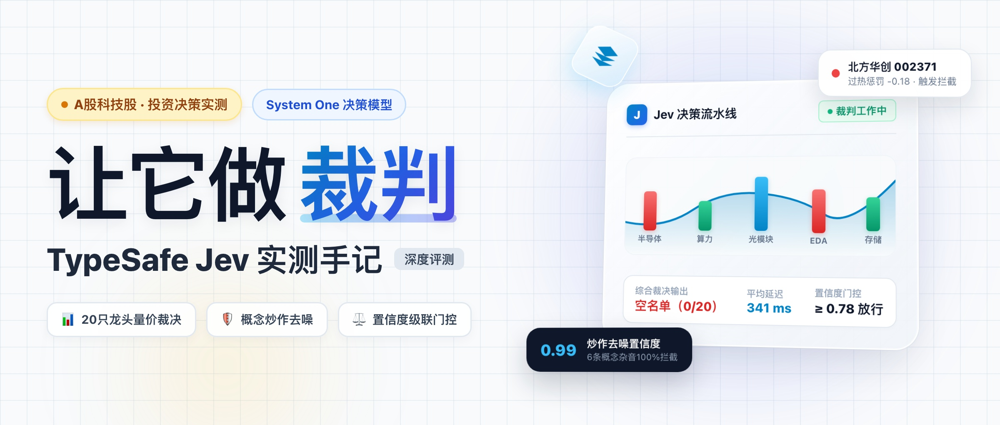
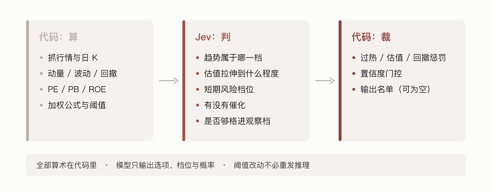
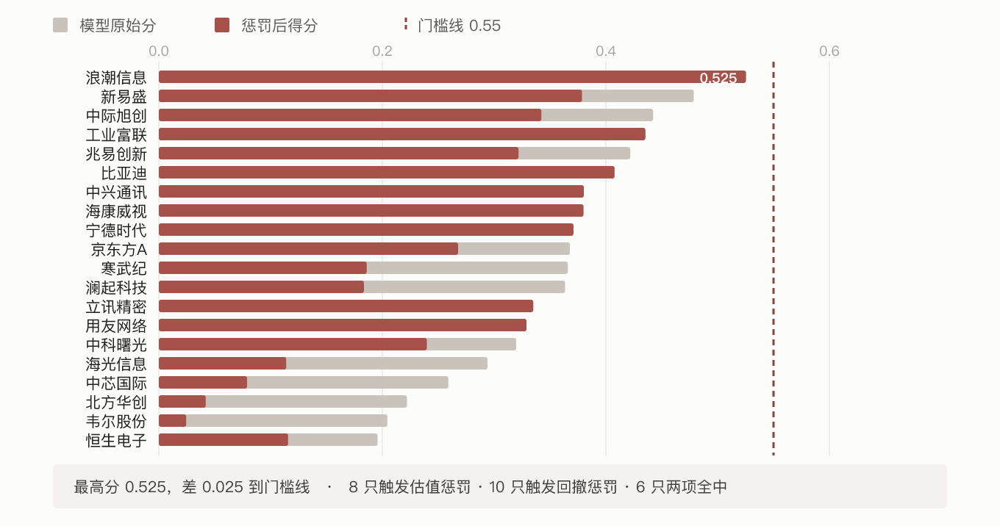
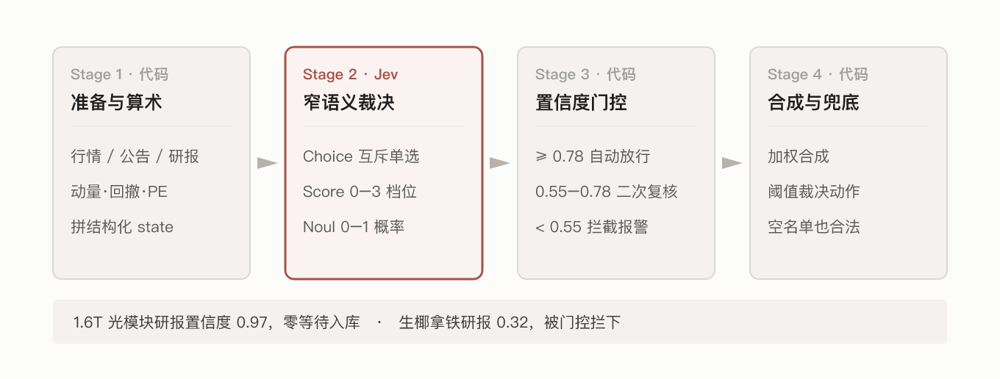
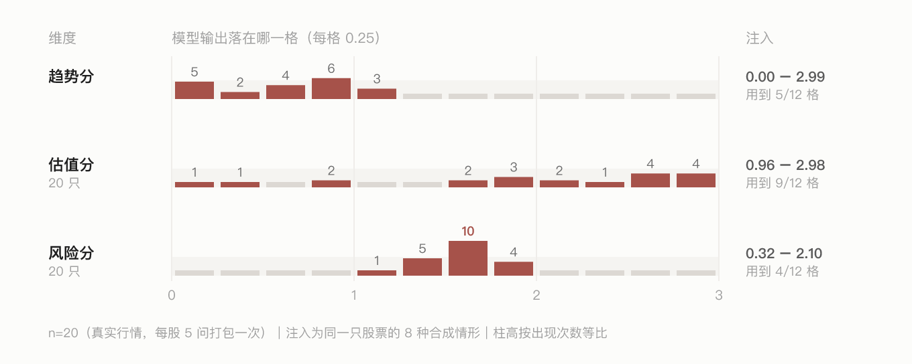
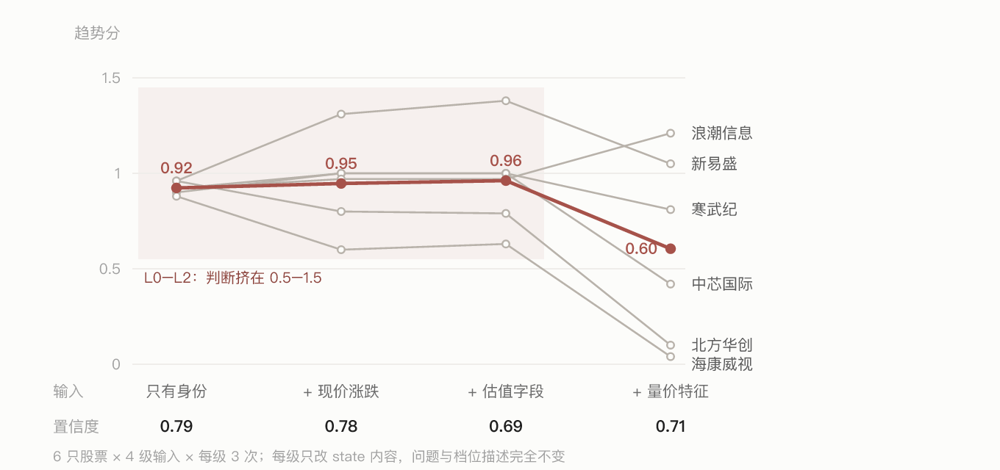
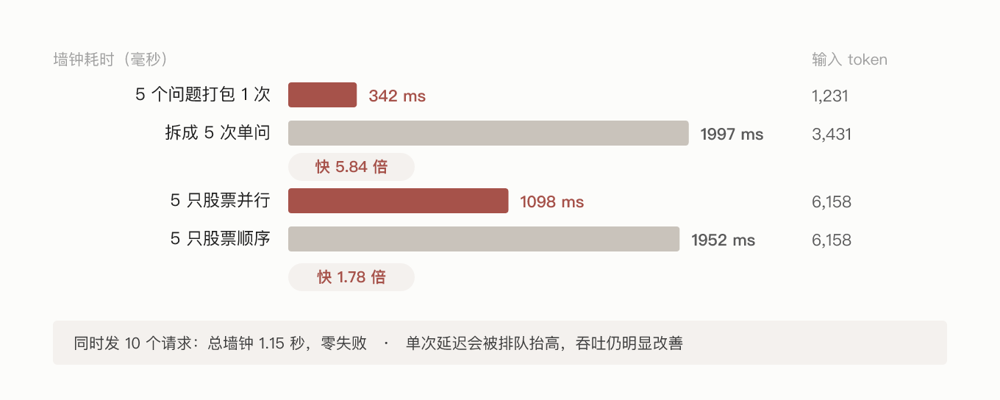
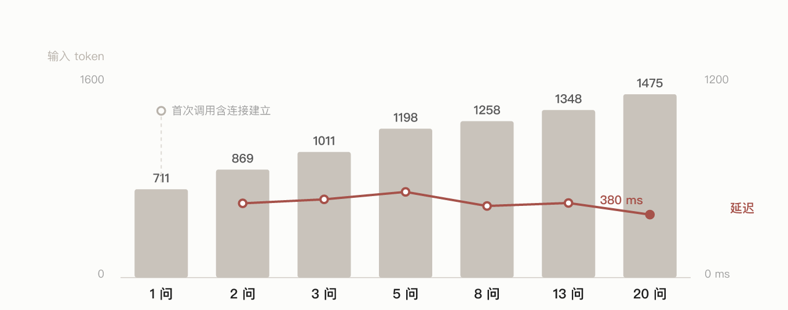

# 让它做裁判：TypeSafe Jev 简单实测股市分析



最近我们在评测 TypeSafe 的 System One 模型 Jev。

它跟常见大模型不是一类：不生成自然语言，只返回带概率和置信度的结构化字段。官方称它快、便宜，专为确定性工作流设计。

为了看它在半结构化任务里能不能用、怎么用，我们用 A 股科技股投研和盘后资讯处理搭了一条流水线，跑了几轮真机测试。下面是我们划出的分工边界、实测数据，和几处没预料到的地方。

文中证券名称只作测试标的，不构成投资建议。

---

## 一、先把分工划清



流水线按四层切开：

```text
1. 数据准备（代码）   清洗行情与资讯，算动量、回撤、PE 等客观数值。Jev 不碰算术。
2. 窄语义裁决（Jev）  针对准备好的特征，只回答三种原子问题。
3. 置信度门控（代码） 读返回里的 confidence，决定自动流转、转人工还是拦截。
4. 综合动作（代码）   加权算分、扣惩罚，决定最终动作。
```

Jev 的最小调用单元是三个原语：

- `Choice`：互斥单选，返回命中的选项、各选项概率、置信度；
- `Score`：0–3 档位加权分，返回分数、各档概率、置信度；
- `Noul`：0–1 连续概率，类似浮点开关（实测不带置信度）。

---

## 二、场景 1：20 只科技股，最后交回分值评估列表

选 20 只科技龙头（半导体、算力、光模块等），把算好的指标拼成结构化 `state` 发过去：

```json
{
  "task": "A股科技股观察档语义判断（评测）",
  "stock": {
    "metrics": {
      "code": "002371", "name": "北方华创", "sector": "半导体设备",
      "momentum_5d_pct": 8.45, "momentum_20d_pct": -4.10, "momentum_60d_pct": -21.01,
      "volatility_20d_annualized_approx_pct": 34.8, "max_drawdown_60d_pct": -33.02,
      "pe_ttm": 73.11, "pb": 12.15, "roe": 8.58, "total_mkt_cap_yi": 4927.4
    }
  }
}
```

每只股票一次性问 5 个问题（趋势、估值拉伸、短期风险、近期催化、是否够格进观察档），410 ms 后返回纯 JSON：

```json
{
  "trend_quality": {
    "type": "score", "score": 0.13, "confidence": 0.87,
    "probabilities": { "0": 0.88, "1": 0.12, "2": 0, "3": 0 }
  },
  "valuation_stretch": {
    "type": "score", "score": 2.68, "confidence": 0.68,
    "probabilities": { "0": 0, "1": 0, "2": 0.31, "3": 0.69 }
  },
  "risk_flag": {
    "type": "score", "score": 1.90, "confidence": 0.90,
    "probabilities": { "0": 0, "1": 0.10, "2": 0.90, "3": 0 }
  },
  "catalyst_signal": { "type": "noul", "noul": 0.51 },
  "fit_for_rotation": { "type": "noul", "noul": 0.51 }
}
```

趋势分 0.13 落在弱势下行档，估值分 2.68 落在偏贵档。代码加权汇总后，20 只一只没进观察档。



分数和惩罚计数图上都有，这里只补图上读不出来的三点：

- 惩罚是乘法级的。北方华创原始分 0.222，扣掉 0.18 的过热惩罚后剩 0.042，从第 2 名掉到第 19 名。
- 门控看两把尺子。用友网络平均置信度 0.58 低于门槛被挑出；宁德时代置信度 0.91 很高，但适配度只有 0.41，同样被挑出。只看置信度会漏掉后者。
- 空名单是合法输出。系统里得给“什么都不做”留一个出口，否则它会硬凑一份名单。

---

## 三、场景 2：16 条盘后快讯，能分对几类

挑 16 条盘后快讯（含概念炒作与常规公告），每条一次调用问 4 件事：赛道分类（Choice）、催化强度（Score 0–3）、实质性（Noul）、处理动作（Choice）。

```json
{
  "theme_category": { "type": "choice", "choice": "ai_compute_infrastructure", "confidence": 1.0 },
  "catalyst_intensity": { "type": "score", "score": 2.0, "confidence": 0.99 },
  "substance_authenticity": { "type": "noul", "noul": 0.69 },
  "pipeline_routing": { "type": "choice", "choice": "prioritize_deep_research", "confidence": 0.73 }
}
```

中位延迟 341 ms，单条输入平均 944 token。16 条的分流结果：

| 处理动作 | 条数 | 典型样本 |
|---|---|---|
| 优先深研 | 8 | GB200 NVL72 批量交付（催化 2.0）、EDA 打通 7nm（催化 2.28） |
| 标准归档 | 4 | 人形机器人进厂试水、元宇宙文旅框架协议 |
| 转人工核对 | 3 | 小家电“全栈 AI”生态、座舱芯片定点转述、股吧股权传闻 |
| 直接过滤 | 1 | 物业公司“量子计算收费”（实质性 0.14） |

16 条里 6 条被判为 `noise_or_concept_hype`，类别置信度 0.70–1.00，多数在 0.90 以上。

这里还有个分类上的问题：落进 noise 的 6 条不全是蹭概念，股份减持公告、参展快讯这类“无正向催化的常规信息”也被塞了进来——分类表只有一个 noise 桶，缺一个“常规信息”档，得自己补。

---

## 四、场景 3：12 篇研报，用置信度做门控



我们想验证的是：置信度能不能当开关用，而不是当展示数据。研报入库流程里设三级，阈值写在代码里。

12 篇不同领域的材料，中位延迟 288 ms：

| 分档 | 阈值 | 占比 | 样本 |
|---|---|---|---|
| 自动放行 | ≥ 0.78 | 6/12 = 50.0% | 1.6T 光模块专题（0.97） |
| 二次复核 | 0.55–0.78 | 5/12 = 41.7% | 量子退火综述（0.74）、出口管制压力测试（0.58） |
| 拦截报警 | < 0.55 | 1/12 = 8.3% | 生椰拿铁门店扩张（0.32） |

0.78 这条线正好落在 0.74 和 0.87 之间的空档里，所以没有一篇卡在线的边缘来回抖。中档偏厚，想提高自动化率可以把线往回压。

---

## 五、四处和我们预期不一样的地方

### 1. 真实样本只用到 0–3 分的一小段



20 只真实股票的趋势分落在 0.00–1.16，风险分挤在 1.13–1.94。只有塞进一只暴涨 49% 的极端样本，趋势分才冲到 2.99。

门槛不能凭想象设在 2.4 分，得先看真实样本的分布再定线。阈值是代码里的常量，改它不用重跑推理。

### 2. 喂得越少，越容易拿到高置信的中庸答案



同一批股票、同一套问题，只改输入信息量：

| 输入级别 | 内容 | 6 只趋势分 | 平均置信度 |
|---|---|---|---|
| L0 | 只有名称 / 代码 / 板块 | 0.88–0.96 | 0.79 |
| L1 | + 现价与今日涨跌 | 0.60–1.31 | 0.78 |
| L2 | + PE / PB / ROE / 市值 | 0.63–1.38 | 0.69 |
| L3 | + 动量 / 波动 / 回撤 | 0.04–1.21 | 0.71 |

信息不够时它不报错，而是给一个看起来很正常的中间值，置信度也不低；可喂到全特征之后，置信度反而比只有名称时更低。该先备齐输入，再去问它。

### 3. 一次问完比分五次问快 5.8 倍



同一份数据，拆成 5 次单问累加 1997 ms、输入 3431 token；打包成一次问 5 个问题 342 ms、1231 token。时间差 5.84 倍，输入 token 差 2.79 倍——同一份 state 发了五遍，而五个答案的主字段完全一致。



问题数从 1 加到 20，输入 token 711 → 1475，中位耗时始终在 380–517 ms。多个问题是并行评估的，问题数不构成额外时间成本（首次调用的 1006 ms 含建连）。

### 4. 换个写法，答案会漂

数据内容不变，只换 `state` 的组织形式，同一只股票的答案就不一样：

| 写法 | 浪潮信息 趋势分 | 新易盛 风险分 |
|---|---|---|
| 结构化 JSON | 1.25 | 1.42 |
| 单行分号文本 | 1.20 | 1.69 |
| 自然语言段落 | 0.95 | 1.63 |

差距最大 0.30。不过同一写法重跑 4 次，4 次签名都不一样——模型本身有随机性，单次对比说明不了太多。方向倒是稳定的：6 只里有 5 只在 JSON 写法下风险分最低。

所以 `state` 模板要像 Schema 一样管起来，改了就记版本，别随手改写。

---

## 六、并发与账单

| 并发量 | 总墙钟 | 单请求延迟 |
|---|---|---|
| 3 | 1,131 ms | 1 个快（408 ms）+ 2 个排队（约 1.1 s） |
| 5 | 1,085 ms | 3 个快（384–412 ms）+ 2 个排队（约 1.08 s） |
| 10 | 1,145 ms | 5 个快（367–448 ms）+ 5 个排队（1.10–1.14 s） |

零失败。总墙钟卡在 1.1 秒附近，说明服务端在分批回包，大约 5 个一批。规划吞吐时按“单次 400 ms”算会低估排队。

三个场景累计 133 次调用（主轮 60 + 扩展 45 + 多场景 28），输入 14.2 万 token，账单 $0.0060，约合人民币 4 分。输入 $0.042 / 百万 token，输出免费。

---

## 七、适用边界（还在探索中，仅供参考）

适合交给它：

- 前置特征由代码算好，只需要窄语义归类
- 需要布尔开关、分档标签、数值评分
- 高频流水线的第一道低成本过滤器
- 当置信度守门员，高置信自动放行、低置信转人工

不要交给它：

- 任何算术。PE、收益率、资金量都归代码
- 端到端问投资意见
- 输入没有事实依据时逼它出结论，只会拿到虚假的高置信中庸分
- 写长文，它不具备长文本生成能力

把这四段位置摆对，它的价值才成立：快、便宜、输出结构稳定，代价是它只能回答你问得很窄的问题。

---

> **免责声明**：文中证券代码与公司名称仅作为大模型工程性能评测的测试标的使用，不构成任何投资建议。
